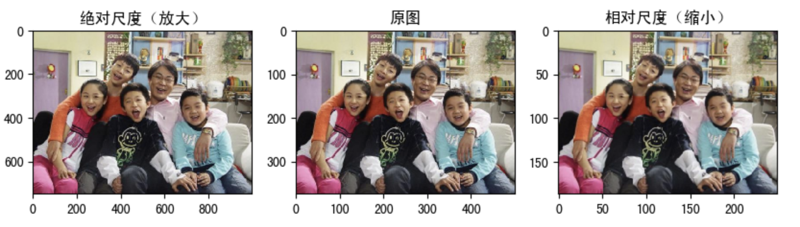
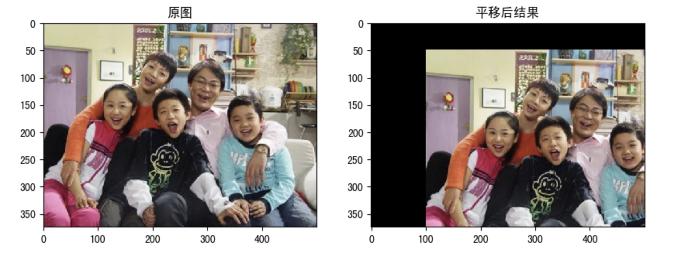
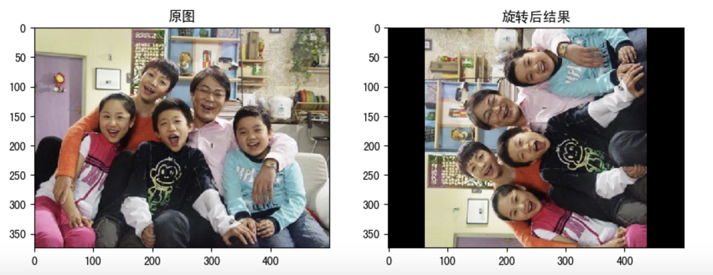
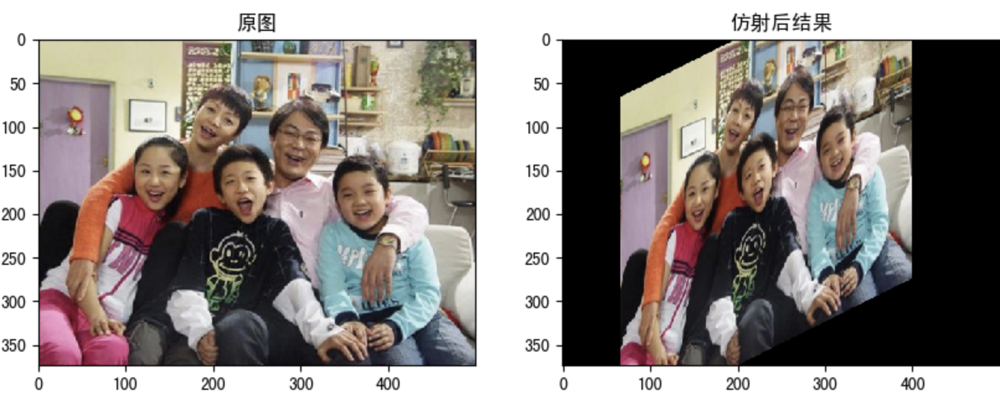
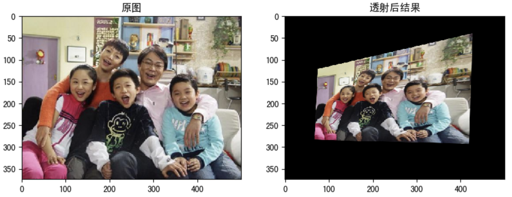
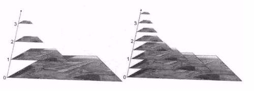

# 几何变换


**学习目标**

- 掌握图像的缩放，平移，旋转等

- 了解数字图像的仿射变换和透射变换


## 1 图像缩放

缩放是对图像的大小进行调整，即使图像放大或缩小。

1. API

```python
cv2.resize(src,dsize,fx=0,fy=0,interpolation=cv2.INTER_LINEAR)
```

参数：

- src : 输入图像

- dsize: 绝对尺寸，直接指定调整后图像的大小

- fx,fy: 相对尺寸，将dsize设置为None，然后将fx和fy设置为比例因子即可

- interpolation：插值方法，

  | 插值              | 含义                 |
  | ----------------- | -------------------- |
  | cv2.INTER_LINEAR  | 双线性插值法         |
  | cv2.INTER_NEAREST | 最近邻插值           |
  | cv2.INTER_AREA    | 像素区域重采样(默认) |
  | cv2.INTER_CUBIC   | 双三次插值           |
  |                   |                      |

  2. 示例

     ```python
     import numpy as np
     import cv2 as cv
     
     img1 = cv.imread("./image/dog.jpeg")
     
     # 绝对尺寸
     rows,cols = img1.shape[:2]
     res = cv.resize(img1,(2*cols,2*rows),interpolation=cv.INTER_CUBIC)
     
     # 相对尺寸
     res1 = cv.resize(img1,None,fx=0.5,fy=0.5)
     
     # 图像显示(生成窗口绘制图像)
     cv.imshow("orignal",img1)
     cv.imshow("enlarge",res)
     cv.imshow("shrink）",res1)
     cv.waitKey(0)
     
     # 在jupyternotebook中显示图像
     fig,axes=plt.subplots(nrows=1,ncols=3,figsize=(10,8),dpi=100)
     axes[0].imshow(res[:,:,::-1])
     axes[0].set_title("绝对尺度（放大）")
     axes[1].imshow(img1[:,:,::-1])
     axes[1].set_title("原图")
     axes[2].imshow(res1[:,:,::-1])
     axes[2].set_title("相对尺度（缩小）")
     plt.show()
     ```

     


## 2 图像平移

图像平移将图像按照指定方向和距离，移动到相应的位置。

1. API

```python
cv.warpAffine(img,M,dsize)
```

参数：

- img: 输入图像

- M： 2$*$3移动矩阵

  对于(x,y)处的像素点，要把它移动到($$x+t_x  , y+t_y$$)处时，M矩阵应如下设置：

  $$M=\begin{bmatrix}
  1&0&t_x\\
  0&1&t_y\\
  \end{bmatrix}$$

  注意：将$M$设置为np.float32类型的Numpy数组。

- dsize: 输出图像的大小

  **注意：输出图像的大小，它应该是(宽度，高度)的形式。请记住,width=列数，height=行数。**

2. 示例

需求是将图像的像素点移动(50,100)的距离：

```python
import numpy as np
import cv2 as cv
import matplotlib.pyplot as plt
img1 = cv.imread("./image/image2.jpg")
rows,cols = img1.shape[:2]

# 平移矩阵
M = M = np.float32([[1,0,100],[0,1,50]])
dst = cv.warpAffine(img1,M,(cols,rows))

fig,axes=plt.subplots(nrows=1,ncols=2,figsize=(10,8),dpi=100)
axes[0].imshow(img1[:,:,::-1])
axes[0].set_title("原图")
axes[1].imshow(dst[:,:,::-1])
axes[1].set_title("平移后结果")
plt.show()
```



## 3 图像旋转

图像旋转首先根据旋转角度和旋转中心获取旋转矩阵，然后据旋转矩阵进行仿射变换，即可实现任意角度和任意中心的旋转效果。

1. API

   ```
   cv2.getRotationMatrix2D(center, angle, scale)
   ```

   参数：

   - center：旋转中心
   - angle：旋转角度
   - scale：缩放比例

   返回：

   - M：旋转矩阵

     调用cv.warpAffine完成图像的旋转

2. 示例

   ```python
   import numpy as np
   import cv2 as cv
   import matplotlib.pyplot as plt
   img = cv.imread("./image/image2.jpg")
   rows,cols = img.shape[:2]
   # 生成旋转矩阵
   M = cv.getRotationMatrix2D((cols/2,rows/2),90,1)
   # 进行放射变换
   dst = cv.warpAffine(img,M,(cols,rows))
   
   fig,axes=plt.subplots(nrows=1,ncols=2,figsize=(10,8),dpi=100)
   axes[0].imshow(img1[:,:,::-1])
   axes[0].set_title("原图")
   axes[1].imshow(dst[:,:,::-1])
   axes[1].set_title("旋转后结果")
   plt.show()
   ```

   


## 4 仿射变换

	图像的仿射变换涉及到图像的形状位置角度的变化，是深度学习预处理中常到的功能,仿射变换具主要是对图像的缩放scale，旋转rotate，剪切shear，翻转flip和平移translate等操作的组合。在OpenCV中，仿射变换的矩阵是一个2×3的矩阵，


$$
M = \left[\begin{matrix}
A & B
\end{matrix}\right]=\left[\begin{matrix}
a_{00}& a_{01}&b_0\\
a_{10}&a_{11}&b_1
\end{matrix}\right]
$$
其中左边的2×2子矩阵$A$是线性变换矩阵，右边的2×1子矩阵$B$是平移项：
$$
A=\left[
\begin{matrix}
a_{00} & a_{01}\\
a_{10} & a_{11}
\end{matrix}
\right],
B=\left[
\begin{matrix}
b_{0}\\
b_{1}
\end{matrix}
\right]
$$
对于图像上的任一位置(x,y)，仿射变换执行的是如下的操作：
$$
T_{affine}=A\left[\begin{matrix}
x\\
y
\end{matrix}
\right]+B=M\left[\begin{matrix}x\\y\\1\end{matrix}\right]
$$

需要注意的是，对于图像而言，宽度方向是x，高度方向是y，坐标的顺序和图像像素对应下标一致。所以原点的位置不是左下角而是右上角，y的方向也不是向上，而是向下。

在仿射变换中，原图中所有的平行线在结果图像中同样平行。为了创建这个矩阵我们需要从原图像中找到三个点以及他们在输出图像中的位置。然后cv2.getAffineTransform 会创建一个 2x3 的矩阵，最后这个矩阵会被传给函数 cv2.warpAffine。

示例

```python
import numpy as np
import cv2 as cv
import matplotlib.pyplot as plt
img = cv.imread("./image/image2.jpg")
rows,cols = img.shape[:2]

pts1 = np.float32([[50,50],[200,50],[50,200]])
pts2 = np.float32([[100,100],[200,50],[100,250]])
M = cv.getAffineTransform(pts1,pts2)
dst = cv.warpAffine(img,M,(cols,rows))

fig,axes=plt.subplots(nrows=1,ncols=2,figsize=(10,8),dpi=100)
axes[0].imshow(img[:,:,::-1])
axes[0].set_title("原图")
axes[1].imshow(dst[:,:,::-1])
axes[1].set_title("仿射后结果")
plt.show()
```




## 5 透射变换

透射变换是视角变化的结果，我们要找到四个点，其中任意三个不共线，然后获取变换矩阵，再进行透射变换。通过函数cv.getPerspectiveTransform找到变换矩阵，将cv.warpPerspective应用于此3x3变换矩阵。

1. 示例

   ```python
   import numpy as np
   import cv2 as cv
   import matplotlib.pyplot as plt
   img = cv.imread("./image/image2.jpg")
   rows,cols = img.shape[:2]
   
   pts1 = np.float32([[56,65],[368,52],[28,387],[389,390]])
   pts2 = np.float32([[100,145],[300,100],[80,290],[310,300]])
   
   M = cv.getPerspectiveTransform(pts1,pts2)
   
   dst = cv.warpPerspective(img,M,(cols,rows))
   
   
   fig,axes=plt.subplots(nrows=1,ncols=2,figsize=(10,8),dpi=100)
   axes[0].imshow(img[:,:,::-1])
   axes[0].set_title("原图")
   axes[1].imshow(dst[:,:,::-1])
   axes[1].set_title("透射后结果")
   plt.show()
   ```

   

## 6 图像金字塔

图像金字塔是图像多尺度表达的一种，最主要用于图像的分割，是一种以多分辨率来解释图像的有效但概念简单的结构。

图像金字塔用于机器视觉和图像压缩，一幅图像的金字塔是一系列以金字塔形状排列的分辨率逐步降低，且来源于同一张原始图的图像集合。其通过梯次向下采样获得，直到达到某个终止条件才停止采样。

金字塔的底部是待处理图像的高分辨率表示，而顶部是低分辨率的近似，层级越高，图像越小，分辨率越低。

1. API

   ```python
   cv.pyrUp(img)   	#对图像进行上采样
   cv.pyrDown(img)    	#对图像进行下采样
   ```

2. 示例

   ```python
   import numpy as np
   import cv2 as cv
   import matplotlib.pyplot as plt
   img = cv.imread("./image/image2.jpg")
   
   up_img = cv.pyrUp(img)  # 上采样操作
   img_1 = cv.pyrDown(img)  # 下采样操作
   cv.imshow('enlarge', up_img)
   cv.imshow('original', img)
   cv.imshow('shrink', img_1)
   cv.waitKey(0)
   cv.destroyAllWindows()
   ```

   


**总结**

1. 图像缩放：cv.resize()

2. 图像平移：

   指定平移矩阵后，调用cv.warpAffine()平移图像

3. 图像旋转：

   调用cv.getRotationMatrix2D获取旋转矩阵，然后调用cv.warpAffine()进行旋转

4. 仿射变换：

   调用gcv.getAffineTransform将创建变换矩阵，最后该矩阵将传递给cv.warpAffine()进行变换

5. 透射变换：

   通过函数cv.getPerspectiveTransform()找到变换矩阵，将cv.warpPerspective()进行投射变换

6. 金字塔

   图像金字塔是图像多尺度表达的一种，使用的API：

   cv.pyrUp(): 向上采样

   cv.pyrDown(): 向下采样

