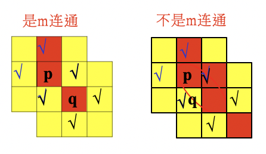
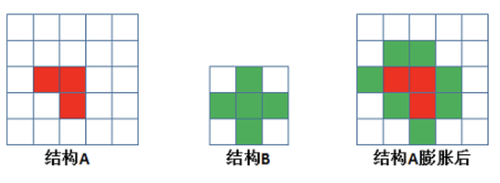
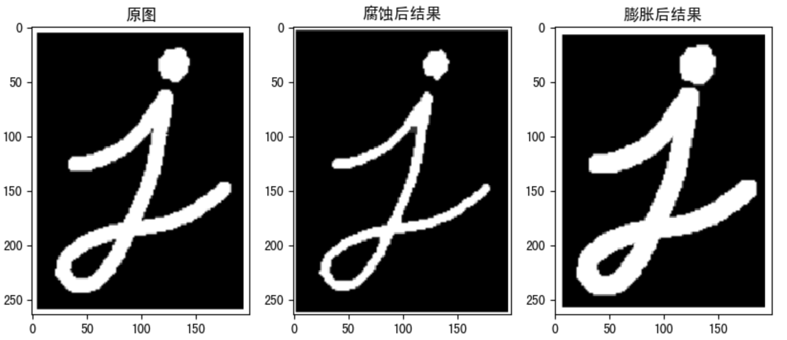

# 形态学操作

**学习目标**

- 理解图像的邻域，连通性

- 了解不同的形态学操作：腐蚀，膨胀，开闭运算，礼帽和黑帽等，及其不同操作之间的关系


# 1 连通性

在图像中，最小的单位是像素，每个像素周围有8个邻接像素，常见的邻接关系有2种：4邻接、8邻接和D邻接。分别如下图所示：


- 4邻接：像素p(x,y)的4邻域是：(x+1,y)；(x-1,y)；(x,y+1)；(x,y-1)，用$N_4(p)$表示像素p的4邻接

- D邻接：像素p(x,y)的D邻域是：对角上的点 (x+1,y+1)；(x+1,y-1)；(x-1,y+1)；(x-1,y-1)，用$N_D(p)$表示像素p的D邻域
- 8邻接：像素p(x,y)的8邻域是： 4邻域的点 ＋ D邻域的点，用$N_{8}(p)$表示像素p的8邻域

**连通性**是描述区域和边界的重要概念，两个像素连通的两个必要条件是：

1. 两个像素的位置是否相邻

2. 两个像素的灰度值是否满足特定的相 似性准则（或者是否相等

根据连通性的定义，有4联通、8联通和m联通三种。

- 4联通：对于具有值$V$的像素$p$和$q$，如果$q$在 集合$N_4(p)$中，则称这两个像素是4连通。

- 8联通：对于具有值$V$的像素$p$和$q$，如果$q$在集
  合$N_8(p)$中，则称这两个像素是8连通。

  

- 对于具有值$V$的像素$p$和$q$，如果:

  1. $q$在集合$N_4(p)$中，或

  2. $q$在集合$N_D(p)$中，并且$N_4(p)$与$N_4(q) $的交集为空（没有值$V$的像素） 

  则称这两个像素是$m$连通的，即4连通和D连通的混合连通。

  

# 2 形态学操作

形态学转换是基于图像形状的一些简单操作。它通常在二进制图像上执行。腐蚀和膨胀是两个基本的形态学运算符。然后它的变体形式如开运算，闭运算，礼帽黑帽等。

## 2.1 腐蚀和膨胀

腐蚀和膨胀是最基本的形态学操作，腐蚀和膨胀都是针对白色部分（高亮部分）而言的。

膨胀就是使图像中高亮部分扩张，效果图拥有比原图更大的高亮区域；腐蚀是原图中的高亮区域被蚕食，效果图拥有比原图更小的高亮区域。膨胀是求局部最大值的操作，腐蚀是求局部最小值的操作。

1. 腐蚀

   	**具体操作**是：用一个结构元素扫描图像中的每一个像素，用结构元素中的每一个像素与其覆盖的像素做“与”操作，如果都为1，则该像素为1，否则为0。如下图所示，结构A被结构B腐蚀后：

   

   	腐蚀的**作用**是消除物体边界点，使目标缩小，可以消除小于结构元素的噪声点

   **API**：

   ```python
   cv.erode(img,kernel,iterations)
   ```

   参数：

   - img: 要处理的图像
   - kernel: 核结构
   - iterations: 腐蚀的次数，默认是1

2. 膨胀

   	**具体操作**是：用一个结构元素扫描图像中的每一个像素，用结构元素中的每一个像素与其覆盖的像素做“与”操作，如果都为0，则该像素为0，否则为1。如下图所示，结构A被结构B腐蚀后：

   

   	膨胀的作用是将与物体接触的所有背景点合并到物体中，使目标增大，可添补目标中的孔洞。

   **API**：

   ```python
   cv.dilate(img,kernel,iterations)
   ```

   参数：

   - img: 要处理的图像

   - kernel: 核结构
   - iterations: 腐蚀的次数，默认是1

3. 示例

   我们使用一个5$*$5的卷积核实现腐蚀和膨胀的运算：

   ```python
   import numpy as np
   import cv2 as cv
   import matplotlib.pyplot as plt
   # 1 读取图像
   img = cv.imread("./image/image3.png")
   # 2 创建核结构
   kernel = np.ones((5, 5), np.uint8)
   
   # 3 图像腐蚀和膨胀
   erosion = cv.erode(img, kernel) # 腐蚀
   dilate = cv.dilate(img,kernel) # 膨胀
   
   # 4 图像展示
   fig,axes=plt.subplots(nrows=1,ncols=3,figsize=(10,8),dpi=100)
   axes[0].imshow(img)
   axes[0].set_title("原图")
   axes[1].imshow(erosion)
   axes[1].set_title("腐蚀后结果")
   axes[2].imshow(dilate)
   axes[2].set_title("膨胀后结果")
   plt.show()
   ```

   

## 2.2 开闭运算

开运算和闭运算是将腐蚀和膨胀按照一定的次序进行处理。 但这两者并不是可逆的，即先开后闭并不能得到原来的图像。

1. 开运算

   开运算是先腐蚀后膨胀，其**作用**是：分离物体，消除小区域。**特点**：消除噪点，去除小的干扰块，而不影响原来的图像。

   

2. 闭运算

   闭运算与开运算相反，是先膨胀后腐蚀，**作用**是消除/“闭合”物体里面的孔洞，**特点**：可以填充闭合区域。

   

3. API 

   ```
   cv.morphologyEx(img, op, kernel)
   ```

   参数：

   - img: 要处理的图像
   - op: 处理方式：若进行开运算，则设为cv.MORPH_OPEN，若进行闭运算，则设为cv.MORPH_CLOSE
   - Kernel： 核结构

4. 示例

   使用10*10的核结构对卷积进行开闭运算的实现。

   ```python
   import numpy as np
   import cv2 as cv
   import matplotlib.pyplot as plt
   # 1 读取图像
   img1 = cv.imread("./image/image5.png")
   img2 = cv.imread("./image/image6.png")
   # 2 创建核结构
   kernel = np.ones((10, 10), np.uint8)
   # 3 图像的开闭运算
   cvOpen = cv.morphologyEx(img1,cv.MORPH_OPEN,kernel) # 开运算
   cvClose = cv.morphologyEx(img2,cv.MORPH_CLOSE,kernel)# 闭运算
   # 4 图像展示
   fig,axes=plt.subplots(nrows=2,ncols=2,figsize=(10,8))
   axes[0,0].imshow(img1)
   axes[0,0].set_title("原图")
   axes[0,1].imshow(cvOpen)
   axes[0,1].set_title("开运算结果")
   axes[1,0].imshow(img2)
   axes[1,0].set_title("原图")
   axes[1,1].imshow(cvClose)
   axes[1,1].set_title("闭运算结果")
   plt.show()
   ```

   

## 2.3 礼帽和黑帽

1. 礼帽运算

   原图像与“开运算“的结果图之差，如下式计算：

   

   　　因为开运算带来的结果是放大了裂缝或者局部低亮度的区域，因此，从原图中减去开运算后的图，得到的效果图突出了比原图轮廓周围的区域更明亮的区域，且这一操作和选择的核的大小相关。

   　　礼帽运算用来分离比邻近点亮一些的斑块。当一幅图像具有大幅的背景的时候，而微小物品比较有规律的情况下，可以使用顶帽运算进行背景提取。

2. 黑帽运算

   为”闭运算“的结果图与原图像之差。数学表达式为：

   　　

   黑帽运算后的效果图突出了比原图轮廓周围的区域更暗的区域，且这一操作和选择的核的大小相关。

   黑帽运算用来分离比邻近点暗一些的斑块。

3. API

   ```
   cv.morphologyEx(img, op, kernel)
   ```

   参数：

   - img: 要处理的图像

   - op: 处理方式：

     | 参数              | 功能     |
     | ----------------- | -------- |
     | cv.MORPH_CLOSE    | 闭运算   |
     | cv.MORPH_OPEN     | 开运算   |
     | cv.MORPH_TOPHAT   | 礼帽运算 |
     | cv.MORPH_BLACKHAT | 黑帽运算 |
     |                   |          |

   - Kernel： 核结构

4.  案例

```python
import numpy as np
import cv2 as cv
import matplotlib.pyplot as plt
# 1 读取图像
img1 = cv.imread("./image/image5.png")
img2 = cv.imread("./image/image6.png")
# 2 创建核结构
kernel = np.ones((10, 10), np.uint8)
# 3 图像的礼帽和黑帽运算
cvOpen = cv.morphologyEx(img1,cv.MORPH_TOPHAT,kernel) # 礼帽运算
cvClose = cv.morphologyEx(img2,cv.MORPH_BLACKHAT,kernel)# 黑帽运算
# 4 图像显示
fig,axes=plt.subplots(nrows=2,ncols=2,figsize=(10,8))
axes[0,0].imshow(img1)
axes[0,0].set_title("原图")
axes[0,1].imshow(cvOpen)
axes[0,1].set_title("礼帽运算结果")
axes[1,0].imshow(img2)
axes[1,0].set_title("原图")
axes[1,1].imshow(cvClose)
axes[1,1].set_title("黑帽运算结果")
plt.show()
```


**总结**

1. 连通性
   邻接关系：4邻接，8邻接和D邻接

   连通性：4连通，8连通和m连通

2. 形态学操作

   - 腐蚀和膨胀：

     腐蚀：求局部最大值

     膨胀：求局部最小值

   - 开闭运算：

     开：先腐蚀后膨胀

     闭：先膨胀后腐蚀

   - 礼帽和黑帽：

     礼帽：原图像与开运算之差

     黑帽：闭运算与原图像之差

