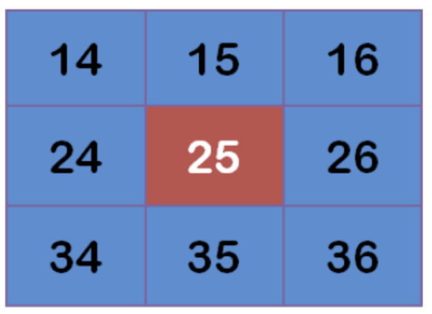

# 图像平滑

**学习目标**

- 了解图像中的噪声类型
- 了解平均滤波，高斯滤波，中值滤波等的内容
- 能够使用滤波器对图像进行处理

# 1 图像噪声

由于图像采集、处理、传输等过程不可避免的会受到噪声的污染，妨碍人们对图像理解及分析处理。常见的图像噪声有高斯噪声、椒盐噪声等。

## 1.1 椒盐噪声

椒盐噪声也称为脉冲噪声，是图像中经常见到的一种噪声，它是一种随机出现的白点或者黑点，可能是亮的区域有黑色像素或是在暗的区域有白色像素（或是两者皆有）。椒盐噪声的成因可能是影像讯号受到突如其来的强烈干扰而产生、类比数位转换器或位元传输错误等。例如失效的感应器导致像素值为最小值，饱和的感应器导致像素值为最大值。


## 1.2 高斯噪声

高斯噪声是指噪声密度函数服从高斯分布的一类噪声。由于高斯噪声在空间和频域中数学上的易处理性，这种噪声(也称为正态噪声)模型经常被用于实践中。高斯随机变量z的概率密度函数由下式给出：
$$
p(z)=\frac{1}{\sqrt{2 \pi} \sigma} e^{\frac{-(z-\mu)^{2}}{2 \sigma^{2}}}
$$

其中z表示灰度值，μ表示z的平均值或期望值，σ表示z的标准差。标准差的平方$σ^{2}$称为z的方差。高斯函数的曲线如图所示。


# 2 图像平滑简介

图像平滑从信号处理的角度看就是去除其中的高频信息，保留低频信息。因此我们可以对图像实施低通滤波。低通滤波可以去除图像中的噪声，对图像进行平滑。

根据滤波器的不同可分为均值滤波，高斯滤波，中值滤波， 双边滤波。

## 2.1 均值滤波

	采用均值滤波模板对图像噪声进行滤除。令 表示中心在(x, y)点，尺寸为m×n 的矩形子图像窗口的坐标组。 均值滤波器可表示为：
$$
\hat{f}(x, y)=\frac{1}{m n} \sum_{(s, t) \in S_{x y}} g(s, t)
$$
由一个归一化卷积框完成的。它只是用卷积框覆盖区域所有像素的平均值来代替中心元素。

例如，3x3标准化的平均过滤器如下所示：
$$
K=\frac{1}{9}\begin{bmatrix}
\ 1 \ \ 1\ \ 1\\ 
\ 1 \ \ 1\ \ 1\\ 
\ 1 \ \ 1\ \ 1 
\end{bmatrix}
$$
	均值滤波的优点是算法简单，计算速度较快，缺点是在去噪的同时去除了很多细节部分，将图像变得模糊。

API:

```
cv.blur(src, ksize, anchor, borderType)
```

参数:

- src：输入图像
- ksize：卷积核的大小
- anchor：默认值 (-1,-1) ，表示核中心
- borderType：边界类型

示例：

```python
import cv2 as cv
import numpy as np
from matplotlib import pyplot as plt

img = cv.imread('./image/dogsp.jpeg')

blur = cv.blur(img,(5,5))

plt.figure(figsize=(10,8),dpi=100)
plt.subplot(121),plt.imshow(img[:,:,::-1]),plt.title('原图')
plt.xticks([]), plt.yticks([])
plt.subplot(122),plt.imshow(blur[:,:,::-1]),plt.title('均值滤波后结果')
plt.xticks([]), plt.yticks([])
plt.show()
```


##  2.2 高斯滤波

	二维高斯是构建高斯滤波器的基础，其概率分布函数如下所示：


	G(x,y)的分布是一个突起的帽子的形状。这里的σ可以看作两个值，一个是x方向的标准差$σ_x$，另一个是y方向的标准差$σ_y$。

当$σ_x$和$σ_y$取值越大，整个形状趋近于扁平；当$σ_x$和$σ_y$，整个形状越突起。

	正态分布是一种钟形曲线，越接近中心，取值越大，越远离中心，取值越小。计算平滑结果时，只需要将"中心点"作为原点，其他点按照其在正态曲线上的位置，分配权重，就可以得到一个加权平均值。
	
	高斯平滑在从图像中去除高斯噪声方面非常有效。

**高斯平滑的流程：**

- 首先确定权重矩阵

假定中心点的坐标是（0,0），那么距离它最近的8个点的坐标如下：


更远的点以此类推。

为了计算权重矩阵，需要设定σ的值。假定σ=1.5，则模糊半径为1的权重矩阵如下：


这9个点的权重总和等于0.4787147，如果只计算这9个点的加权平均，还必须让它们的权重之和等于1，因此上面9个值还要分别除以0.4787147，得到最终的权重矩阵。

			****


- 计算高斯模糊

有了权重矩阵，就可以计算高斯模糊的值了。

假设现有9个像素点，灰度值（0-255）如下：



每个点乘以对应的权重值：

 

得到


将这9个值加起来，就是中心点的高斯模糊的值。

对所有点重复这个过程，就得到了高斯模糊后的图像。如果原图是彩色图片，可以对RGB三个通道分别做高斯平滑。

 API：

```python
cv2.GaussianBlur(src,ksize,sigmaX,sigmay,borderType)
```

参数：

- src: 输入图像
-  ksize:高斯卷积核的大小，**注意** ： 卷积核的宽度和高度都应为奇数，且可以不同
- sigmaX: 水平方向的标准差
- sigmaY: 垂直方向的标准差，默认值为0，表示与sigmaX相同
- borderType:填充边界类型

**示例**：

```python
import cv2 as cv
import numpy as np
from matplotlib import pyplot as plt

img = cv.imread('./image/dogGasuss.jpeg')

blur = cv.GaussianBlur(img,(3,3),1)

plt.figure(figsize=(10,8),dpi=100)
plt.subplot(121),plt.imshow(img[:,:,::-1]),plt.title('原图')
plt.xticks([]), plt.yticks([])
plt.subplot(122),plt.imshow(blur[:,:,::-1]),plt.title('高斯滤波后结果')
plt.xticks([]), plt.yticks([])
plt.show()
```


## 2.3 中值滤波

中值滤波是一种典型的非线性滤波技术，基本思想是用像素点邻域灰度值的中值来代替该像素点的灰度值。

中值滤波对椒盐噪声（salt-and-pepper noise）来说尤其有用，因为它不依赖于邻域内那些与典型值差别很大的值。

API：

```python
cv.medianBlur(src, ksize )
```

参数：

- src：输入图像
- ksize：卷积核的大小

示例：

```python
import cv2 as cv
import numpy as np
from matplotlib import pyplot as plt

img = cv.imread('./image/dogsp.jpeg')

blur = cv.medianBlur(img,5)

plt.figure(figsize=(10,8),dpi=100)
plt.subplot(121),plt.imshow(img[:,:,::-1]),plt.title('原图')
plt.xticks([]), plt.yticks([])
plt.subplot(122),plt.imshow(blur[:,:,::-1]),plt.title('中值滤波后结果')
plt.xticks([]), plt.yticks([])
plt.show()
```

	


**总结**

1. 图像噪声

   - 椒盐噪声：图像中随机出现的白点或者黑点
   - 高斯噪声：噪声的概率密度分布是正态分布

2. 图像平滑

   - 均值滤波：算法简单，计算速度快，在去噪的同时去除了很多细节部分，将图像变得模糊

     cv.blur()

   - 高斯滤波: 去除高斯噪声

     cv.GaussianBlur()

   - 中值滤波: 去除椒盐噪声

     cv.medianBlur()