# 模版匹配和霍夫变换

**学习目标**

- 掌握模板匹配的原理，能完成模板匹配的应用
- 理解霍夫线变换的原理，了解霍夫圆检测
- 知道使用OpenCV如何进行线和圆的检测

# 1  模板匹配

## 1.1 原理

所谓的模板匹配，就是在给定的图片中查找和模板最相似的区域，该算法的输入包括模板和图片，整个任务的思路就是按照滑窗的思路不断的移动模板图片，计算其与图像中对应区域的匹配度，最终将匹配度最高的区域选择为最终的结果。

**实现流程：**

- 准备两幅图像：

  1.原图像(I)：在这幅图中，找到与模板相匹配的区域

  2.模板(T)：与原图像进行比对的图像块

  

- 滑动模板图像和原图像进行比对：


将模板块每次移动一个像素 (从左往右，从上往下)，在每一个位置，都计算与模板图像的相似程度。

- 对于每一个位置将计算的相似结果保存在结果矩阵（R）中。如果输入图像的大小（WxH）且模板图像的大小(wxh)，则输出矩阵R的大小为（W-w + 1,H-h + 1）将R显示为图像，如下图所示：

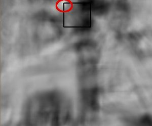

- 获得上述图像后，查找最大值所在的位置，那么该位置对应的区域就被认为是最匹配的。对应的区域就是以该点为顶点，长宽和模板图像一样大小的矩阵。

## 1.2 实现

我们使用OpenCV中的方法实现模板匹配。

API：

```
res = cv.matchTemplate(img,template,method)
```

参数：

- img: 要进行模板匹配的图像
- Template ：模板
- method：实现模板匹配的算法，主要有：
   	1. 平方差匹配(CV_TM_SQDIFF)：利用模板与图像之间的平方差进行匹配，最好的匹配是0，匹配越差，匹配的值越大。
   	2. 相关匹配(CV_TM_CCORR)：利用模板与图像间的乘法进行匹配，数值越大表示匹配程度较高，越小表示匹配效果差。
   	3. 利用相关系数匹配(CV_TM_CCOEFF)：利用模板与图像间的相关系数匹配，1表示完美的匹配，-1表示最差的匹配。

完成匹配后，使用cv.minMaxLoc()方法查找最大值所在的位置即可。如果使用平方差作为比较方法，则最小值位置是最佳匹配位置。

**示例：**

在该案例中，载入要搜索的图像和模板，图像如下所示：


模板如下所示：


通过matchTemplate实现模板匹配，使用minMaxLoc定位最匹配的区域，并用矩形标注最匹配的区域。

```python
import cv2 as cv
import numpy as np
from matplotlib import pyplot as plt
# 1 图像和模板读取
img = cv.imread('./image/wulin2.jpeg')
template = cv.imread('./image/wulin.jpeg')
h,w,l = template.shape
# 2 模板匹配
# 2.1 模板匹配
res = cv.matchTemplate(img, template, cv.TM_CCORR)
# 2.2 返回图像中最匹配的位置，确定左上角的坐标，并将匹配位置绘制在图像上
min_val, max_val, min_loc, max_loc = cv.minMaxLoc(res)
# 使用平方差时最小值为最佳匹配位置
# top_left = min_loc
top_left = max_loc
bottom_right = (top_left[0] + w, top_left[1] + h)
cv.rectangle(img, top_left, bottom_right, (0,255,0), 2)
# 3 图像显示
plt.imshow(img[:,:,::-1])
plt.title('匹配结果'), plt.xticks([]), plt.yticks([])
plt.show()
```

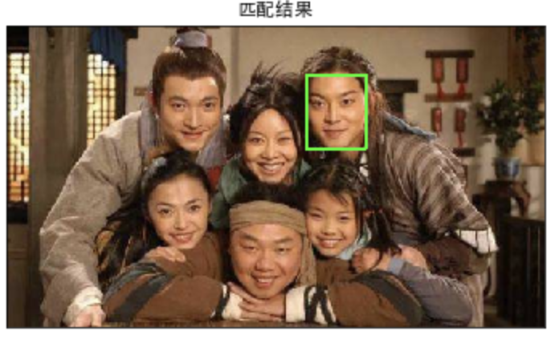

拓展：模板匹配不适用于尺度变换，视角变换后的图像，这时我们就要使用关键点匹配算法，比较经典的关键点检测算法包括SIFT和SURF等，主要的思路是首先通过关键点检测算法获取模板和测试图片中的关键点；然后使用关键点匹配算法处理即可，这些关键点可以很好的处理尺度变化、视角变换、旋转变化、光照变化等，具有很好的不变性。

# 2 霍夫变换

霍夫变换常用来提取图像中的直线和圆等几何形状，如下图所示：

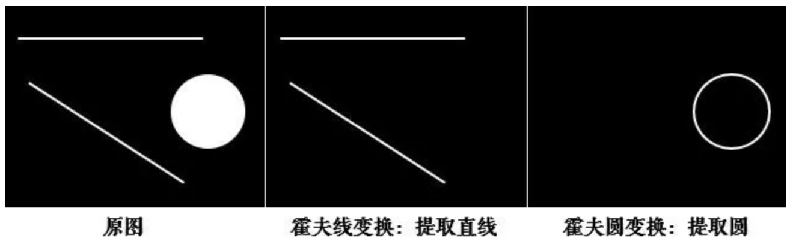


## 2.1 原理

1. **原理**

在笛卡尔坐标系中，一条直线由两个点$$A=(x_1,y_1)$$和$$B=(x_2,y_2)$$确定，如下图所示:


将直线$$y=kx+q​$$可写成关于$$(k,q)​$$的函数表达式：
$$
\begin{cases}q=-kx_1+y_1\\q=-kx_2+y_2\end{cases}
$$
对应的变换通过图形直观的表示下：

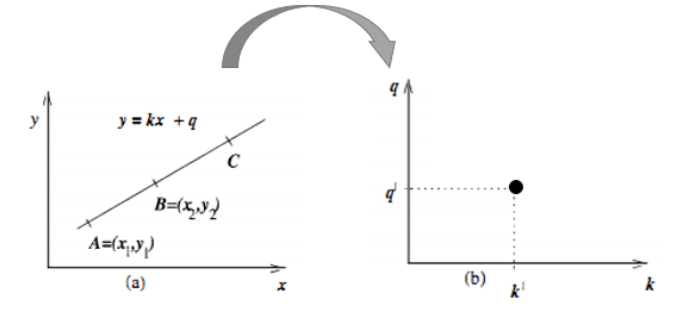

变换后的空间我们叫做霍夫空间。即：**笛卡尔坐标系中的一条直线，对应于霍夫空间中的一个点**。反过来，同样成立，霍夫空间中的一条线，对应于笛卡尔坐标系中一个点，如下所示：
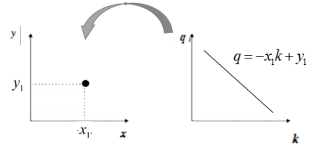

我们再来看下A、B两个点，对应于霍夫空间的情形：

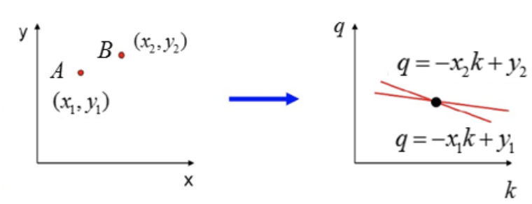

在看下三点共线的情况：

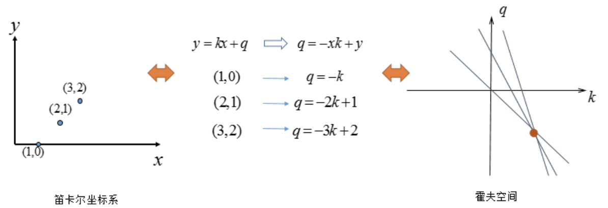

可以看出如果**在笛卡尔坐标系的点共线，那么这些点在霍夫空间中对应的直线交于一点**。

如果不止存在一条直线时，如下所示：


我们选择尽可能多的直线汇成的点，上图中三条直线汇成的A、B两点，将其对应回笛卡尔坐标系中的直线：

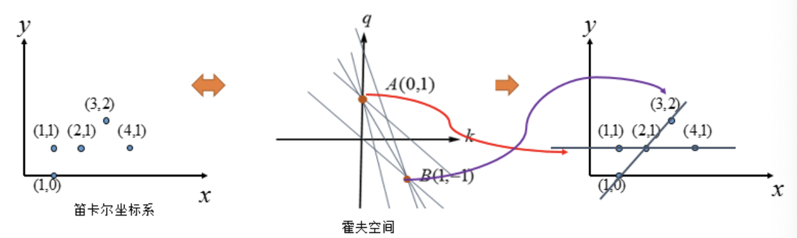

到这里我们似乎已经完成了霍夫变换的求解。但如果像下图这种情况时：

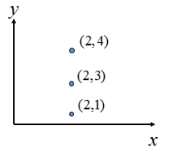

上图中的直线是$$x=2$$，那$$(k,q)$$怎么确定呢？

为了解决这个问题，我们考虑将笛卡尔坐标系转换为极坐标。

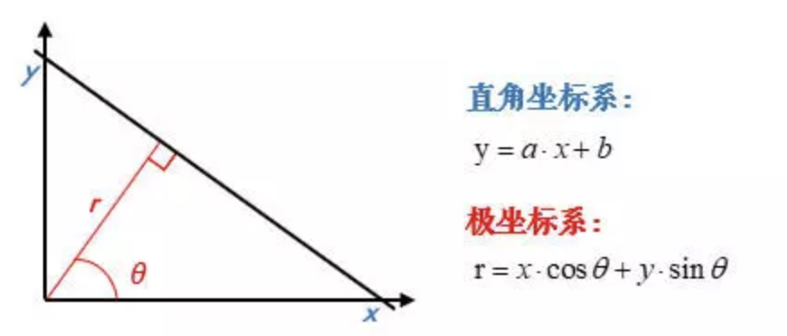

在极坐标下是一样的，极坐标中的点对应于霍夫空间的线，这时的霍夫空间是不在是参数$$(k,q)$$的空间，而是$$(\rho,\theta)$$的空间，$$\rho$$是原点到直线的垂直距离，$$\theta$$表示直线的垂线与横轴顺时针方向的夹角，垂直线的角度为0度，水平线的角度是180度。

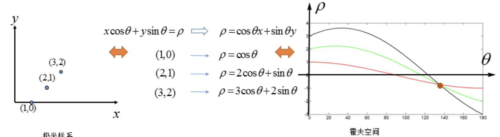

我们只要求得霍夫空间中的交点的位置，即可得到原坐标系下的直线。

2. **实现流程**

   假设有一个大小为100$$*$$100的图片，使用霍夫变换检测图片中的直线，则步骤如下所示：

- 直线都可以使用$$(\rho,\theta)$$ 表示，首先创建一个2D数组，我们叫做**累加器**，初始化所有值为0，行表示$$\rho$$ ，列表示$$\theta$$ 。

  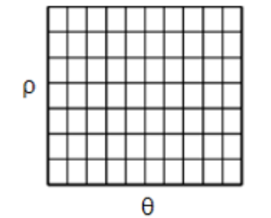

  该数组的大小决定了结果的准确性，若希望角度的精度为1度，那就需要180列。对于$$\rho$$，最大值为图片对角线的距离，如果希望精度达到像素级别，行数应该与图像的对角线的距离相等。

- 取直线上的第一个点$$(x,y)$$，将其带入直线在极坐标中的公式中，然后遍历$$\theta$$的取值：0，1，2，...，180，分别求出对应的$$\rho$$值，如果这个数值在上述累加器中存在相应的位置，则在该位置上加1.

- 取直线上的第二个点，重复上述步骤，更新累加器中的值。对图像中的直线上的每个点都直线以上步骤，每次更新累加器中的值。

- 搜索累加器中的最大值，并找到其对应的$$(\rho,\theta)$$，就可将图像中的直线表示出来。

  

## 2.2 霍夫线检测

在OpenCV中做霍夫线检测是使用的API是：

```
cv.HoughLines(img, rho, theta, threshold)
```

参数：

- img: 检测的图像，要求是二值化的图像，所以在调用霍夫变换之前首先要进行二值化，或者进行Canny边缘检测

- rho、theta: $$\rho$$ 和$$\theta$$的精确度

- threshold: 阈值，只有累加器中的值高于该阈值时才被认为是直线。

  霍夫线检测的整个流程如下图所示，这是在stackflow上一个关于霍夫线变换的解释：

  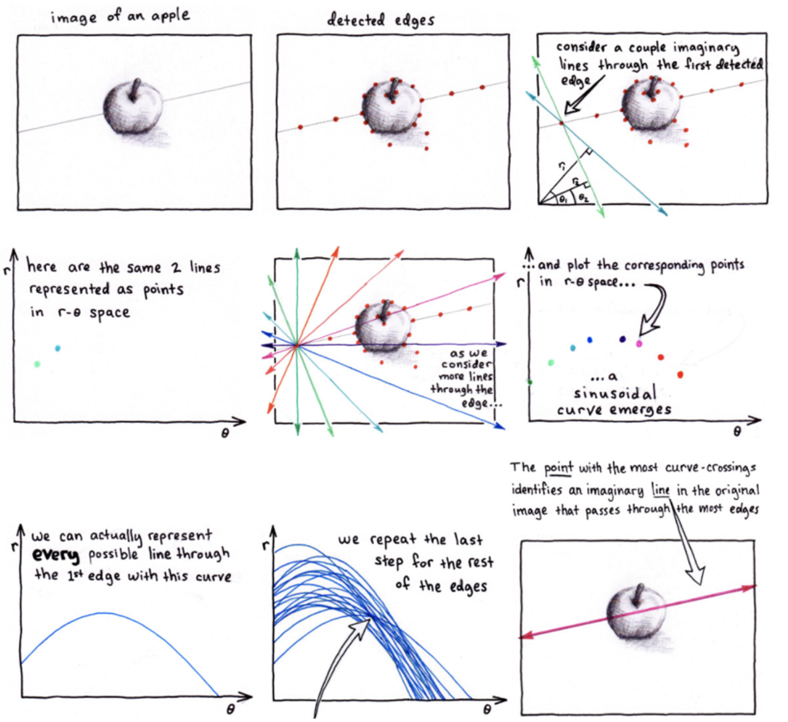

  **示例：**

  检测下述图像中的直线：

  

```python
import numpy as np
import random
import cv2 as cv
import matplotlib.pyplot as plt
# 1.加载图片，转为二值图
img = cv.imread('./image/rili.jpg')

gray = cv.cvtColor(img, cv.COLOR_BGR2GRAY)
edges = cv.Canny(gray, 50, 150)

# 2.霍夫直线变换
lines = cv.HoughLines(edges, 0.8, np.pi / 180, 150)
# 3.将检测的线绘制在图像上（注意是极坐标噢）
for line in lines:
    rho, theta = line[0]
    a = np.cos(theta)
    b = np.sin(theta)
    x0 = a * rho
    y0 = b * rho
    x1 = int(x0 + 1000 * (-b))
    y1 = int(y0 + 1000 * (a))
    x2 = int(x0 - 1000 * (-b))
    y2 = int(y0 - 1000 * (a))
    cv.line(img, (x1, y1), (x2, y2), (0, 255, 0))
# 4. 图像显示
plt.figure(figsize=(10,8),dpi=100)
plt.imshow(img[:,:,::-1]),plt.title('霍夫变换线检测')
plt.xticks([]), plt.yticks([])
plt.show()
```


## 2.3 霍夫圆检测[了解]

1. 原理

   圆的表示式是：
   $$
   (x-a)^2+(y-b)^2=r
   $$
   其中$$a$$和$$b$$表示圆心坐标，$$r$$表示圆半径，因此标准的霍夫圆检测就是在这三个参数组成的三维空间累加器上进行圆形检测，此时效率就会很低，所以OpenCV中使用**霍夫梯度法**进行圆形的检测。

   霍夫梯度法将霍夫圆检测范围两个阶段，第一阶段检测圆心，第二阶段利用圆心推导出圆半径。

   - 圆心检测的原理：圆心是圆周法线的交汇处，设置一个阈值，在某点的相交的直线的条数大于这个阈值就认为该交汇点为圆心。

   - 圆半径确定原理：圆心到圆周上的距离（半径）是相同的，确定一个阈值，只要相同距离的数量大于该阈值，就认为该距离是该圆心的半径。

   原则上霍夫变换可以检测任何形状，但复杂的形状需要的参数就多，霍夫空间的维数就多，因此在程序实现上所需的内存空间以及运行效率上都不利于把标准霍夫变换应用于实际复杂图形的检测中。霍夫梯度法是霍夫变换的改进，它的目的是减小霍夫空间的维度，提高效率。

2. API

   在OpenCV中检测图像中的圆环使用的是API是：

   ```python
   circles = cv.HoughCircles(image, method, dp, minDist, param1=100, param2=100, minRadius=0,maxRadius=0 )
   
   ```

   参数：

   - image：输入图像，应输入灰度图像

   - method：使用霍夫变换圆检测的算法，它的参数是CV_HOUGH_GRADIENT

   - dp：霍夫空间的分辨率，dp=1时表示霍夫空间与输入图像空间的大小一致，dp=2时霍夫空间是输入图像空间的一半，以此类推

   - minDist为圆心之间的最小距离，如果检测到的两个圆心之间距离小于该值，则认为它们是同一个圆心

   - param1：边缘检测时使用Canny算子的高阈值，低阈值是高阈值的一半。

   - param2：检测圆心和确定半径时所共有的阈值

   - minRadius和maxRadius为所检测到的圆半径的最小值和最大值

   返回：

   - circles：输出圆向量，包括三个浮点型的元素——圆心横坐标，圆心纵坐标和圆半径

3. 实现

   由于霍夫圆检测对噪声比较敏感，所以首先对图像进行中值滤波。

   ```python
   import cv2 as cv
   import numpy as np
   import matplotlib.pyplot as plt
   # 1 读取图像，并转换为灰度图
   planets = cv.imread("./image/star.jpeg")
   gay_img = cv.cvtColor(planets, cv.COLOR_BGRA2GRAY)
   # 2 进行中值模糊，去噪点
   img = cv.medianBlur(gay_img, 7)  
   # 3 霍夫圆检测
   circles = cv.HoughCircles(img, cv.HOUGH_GRADIENT, 1, 200, param1=100, param2=30, minRadius=0, maxRadius=100)
   # 4 将检测结果绘制在图像上
   for i in circles[0, :]:  # 遍历矩阵每一行的数据
       # 绘制圆形
       cv.circle(planets, (i[0], i[1]), i[2], (0, 255, 0), 2)
       # 绘制圆心
       cv.circle(planets, (i[0], i[1]), 2, (0, 0, 255), 3)
   # 5 图像显示
   plt.figure(figsize=(10,8),dpi=100)
   plt.imshow(planets[:,:,::-1]),plt.title('霍夫变换圆检测')
   plt.xticks([]), plt.yticks([])
   plt.show()
   ```

   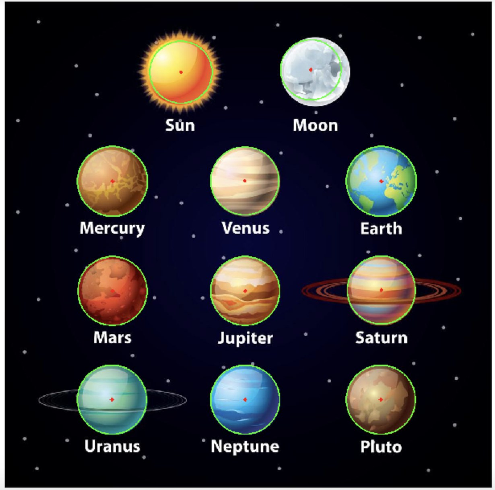


**总结：**

1.  模板匹配

   原理：在给定的图片中查找和模板最相似的区域

   API：利用cv.matchTemplate()进行模板匹配，然后		使用cv.minMaxLoc()搜索最匹配的位置。

2. 霍夫线检测

   原理：将要检测的内容转换到霍夫空间中，利用累加器统计最优解，将检测结果表示处理

   API：cv2.HoughLines()

   注意：该方法输入是的二值化图像，在进行检测前要将图像进行二值化处理

3. 霍夫圆检测

   方法：霍夫梯度法

   API：cv.HoughCircles()

