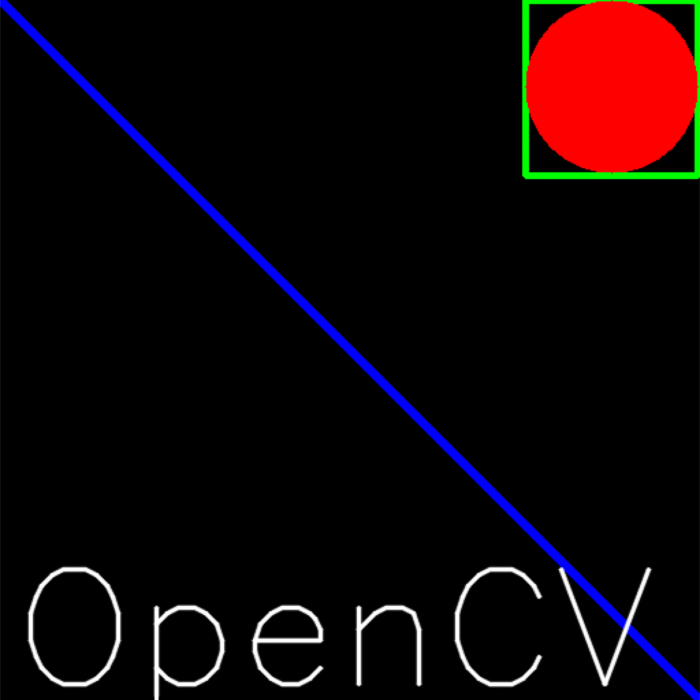

# 图像的基础操作

**学习目标**

- 掌握图像的读取和保存方法

- 能够使用OpenCV在图像上绘制几何图形

- 能够访问图像的像素

- 能够获取图像的属性，并进行通道的分离和合并

- 能够实现颜色空间的变换

  ------


# 1 图像的IO操作

这里我们会给大家介绍如何读取图像，如何显示图像和如何保存图像。

## 1.1 读取图像

1. API

```python
cv.imread()
```

参数：

- 要读取的图像

- 读取方式的标志

   * cv.IMREAD*COLOR：以彩色模式加载图像，任何图像的透明度都将被忽略。这是默认参数。

   * cv.IMREAD*GRAYSCALE：以灰度模式加载图像

   *  cv.IMREAD_UNCHANGED：包括alpha通道的加载图像模式。

     **可以使用1、0或者-1来替代上面三个标志**

2. 参考代码

   ```python
   import numpy as np
   import cv2 as cv
   # Load an color image in grayscale
   img = cv.imread('messi5.jpg',0)
   ```

**注意：如果加载的路径有错误，不会报错，会返回一个None值**

## 1.2显示图像

1 . API

```python
cv.imshow()
```

参数：

- 显示图像的窗口名称，以字符串类型表示
- 要加载的图像

**注意：在调用显示图像的API后，要调用cv.waitKey()给图像绘制留下时间，否则窗口会出现无响应情况，并且图像无法显示出来**。

2. 参考代码

   ```python
   cv.imshow('image',img)
   cv.waitKey(0)
   # 释放窗口
   cv.destroyAllWindows()
   ```

## 1.3 保存图像

1. API

   ```python
   cv.imwrite()
   ```

   参数：

   - 文件名，要保存在哪里
   - 要保存的图像

2. 参考代码

   ```python
   cv.imwrite('messigray.png',img)
   ```

   ## 1.4 总结

   我们通过加载灰度图像，显示图像，如果按's'并退出则保存图像，或者按ESC键直接退出而不保存。

   ```python
   import numpy as np
   import cv2 as cv
   img = cv.imread('messi5.jpg',0)
   cv.imshow('image',img)
   k = cv.waitKey(0)
   if k == 27:         # wait for ESC key to exit
   cv.destroyAllWindows()
   elif k == ord('s'): # wait for 's' key to save and exit
   cv.imwrite('messigray.png',img)
   cv.destroyAllWindows()
   ```

# 2 绘制几何图形

## 2.1 绘制直线

```
cv.line(img,start,end,color,thickness)
```

参数：

- img:要绘制直线的图像
- Start,end: 直线的起点和终点
- color: 线条的颜色
- Thickness: 线条宽度

## 2.2 绘制圆形

```python
cv.circle(img,centerpoint, r, color, thickness)
```

参数：

- img:要绘制圆形的图像
- Centerpoint, r: 圆心和半径
- color: 线条的颜色
- Thickness: 线条宽度，为-1时生成闭合图案并填充颜色

## 2.3 绘制矩形

```python
cv.rectangle(img,leftupper,rightdown,color,thickness)
```

参数：

- img:要绘制矩形的图像
- Leftupper, rightdown: 矩形的左上角和右下角坐标
- color: 线条的颜色
- Thickness: 线条宽度

## 2.4 向图像中添加文字

```python
cv.putText(img,text,station, font, fontsize,color,thickness,cv.LINE_AA)
```

参数：

- img: 图像
- text：要写入的文本数据
- station：文本的放置位置
- font：字体
- Fontsize :字体大小

## 2.5 效果展示

我们生成一个全黑的图像，然后在里面绘制图像并添加文字

```python
import numpy as np
import cv2 as cv
# Create a black image
img = np.zeros((512,512,3), np.uint8)
# Draw a diagonal blue line with thickness of 5 px
cv.line(img,(0,0),(511,511),(255,0,0),5)
cv.rectangle(img,(384,0),(510,128),(0,255,0),3)
cv.circle(img,(447,63), 63, (0,0,255), -1)
font = cv.FONT_HERSHEY_SIMPLEX
cv.putText(img,'OpenCV',(10,500), font, 4,(255,255,255),2,cv.LINE_AA)
cv.imshow("img",img)
cv.waitKey(0)
```

结果：



# 3 获取并修改图像中的像素点

我们可以通过行和列的坐标值获取该像素点的像素值。对于BGR图像，它返回一个蓝，绿，红值的数组。对于灰度图像，仅返回相应的强度值。使用相同的方法对像素值进行修改。

```python
import numpy as np
import cv2 as cv
img = cv.imread('messi5.jpg')
# 获取某个像素点的值
px = img[100,100]
# 仅获取蓝色通道的强度值
blue = img[100,100,0]
# 修改某个位置的像素值
img[100,100] = [255,255,255]
```


# 4 获取图像的属性

图像属性包括行数，列数和通道数，图像数据类型，像素数等。

| 属性     | API       |
| :------- | --------- |
| 形状     | img.shape |
| 图像大小 | img.size  |
| 数据类型 | img.dtype |
|          |           |

# 5 图像通道的拆分与合并

有时需要在B，G，R通道图像上单独工作。在这种情况下，需要将BGR图像分割为单个通道。或者在其他情况下，可能需要将这些单独的通道合并到BGR图像。你可以通过以下方式完成。

```python
# 通道拆分
b,g,r = cv.split(img)
# 通道合并
img = cv.merge((b,g,r))
```

# 6 色彩空间的改变

OpenCV中有150多种颜色空间转换方法。最广泛使用的转换方法有两种，BGR↔Gray和BGR↔HSV。

API

```python
cv.cvtColor(input_image，flag)
```

参数：

- input_image: 进行颜色空间转换的图像
- flag: 转换类型
  - cv.COLOR_BGR2GRAY : BGR↔Gray
  - cv.COLOR_BGR2HSV: BGR→HSV


**总结：**

1. 图像IO操作的API：

   cv.imread():  读取图像

   cv.imshow()：显示图像

   cv.imwrite(): 保存图像

2. 在图像上绘制几何图像

   cv.line(): 绘制直线

   cv.circle(): 绘制圆形

   cv.rectangle(): 绘制矩形

   cv.putText(): 在图像上添加文字

3. 直接使用行列索引获取图像中的像素并进行修改

4. 图像的属性

   | 属性     | API       |
   | -------- | --------- |
   | 形状     | img.shape |
   | 图像大小 | img.size  |
   | 数据类型 | img.dtype |
   |          |           |

5. 拆分通道：cv.split()

   通道合并：cv.merge()

6. 色彩空间的改变

   cv.cvtColor(input_image，flag)


