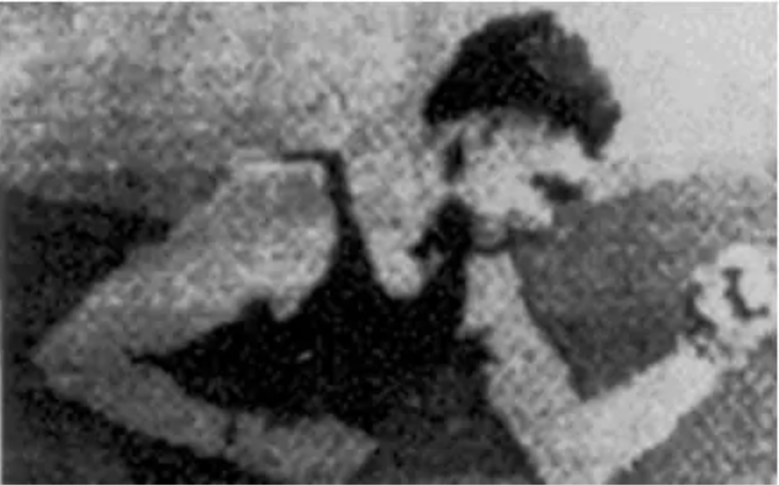
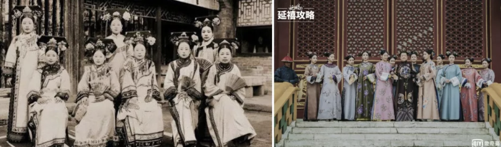
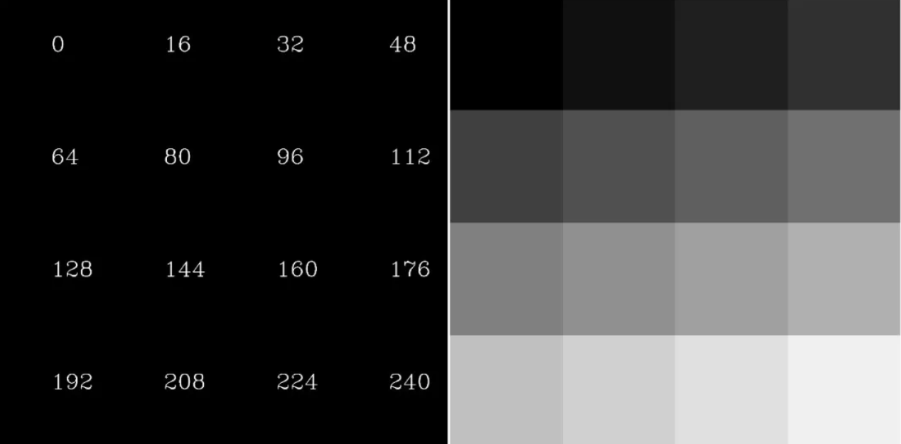
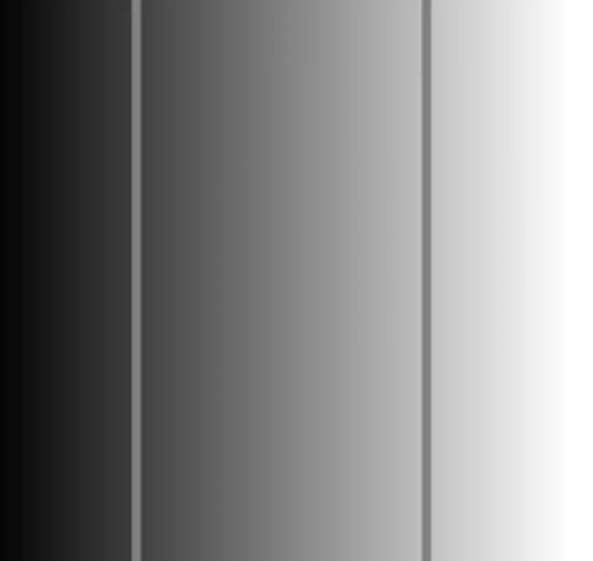

#  图像处理

**学习目标**

- 了解图像的起源
- 知道数字图像的表示
- 了解计算机视觉、图像处理和计算机图形学之间的关系

# 1 图像的起源

## 1.1  图像是什么

> 图像是人类视觉的基础，是自然景物的客观反映，是人类认识世界和人类本身的重要源泉。“图”是物体反射或透射光的分布，“像“是人的视觉系统所接受的图在人脑中所形版的印象或认识，照片、绘画、剪贴画、地图、书法作品、手写汉学、传真、卫星云图、影视画面、X光片、脑电图、心电图等都是图像。—姚敏. 数字图像处理：机械工业出版社，2014年。

## 1.2 模拟图像和数字图像

	图像起源于1826年前后法国科学家Joseph Nicéphore Niépce发明的第一张可永久保存的照片，属于模拟图像。模拟图像又称连续图像，它通过某种物理量（如光、电等）的强弱变化来记录图像亮度信息，所以是连续变换的。模拟信号的特点是容易受干扰，如今已经基本全面被数字图像替代。

	在第一次世界大战后，1921年美国科学家发明了Bartlane System，并从**伦敦传到纽约传输了第一幅数字图像**，其亮度用离散数值表示，将图片编码成5个灰度级，如下图所示，通过海底电缆进行传输。在发送端图片被编码并使用打孔带记录，通过系统传输后在接收方使用特殊的打印机恢复成图像。

1950年左右，计算机被发明，数字图像处理学科正式诞生。

模拟图像和数字图像的对比，我们可以看一下：

# 2 数字图像的表示

## 2.1 位数

	计算机采用0/1编码的系统，数字图像也是利用0/1来记录信息，我们平常接触的图像都是8位数图像，包含0～255灰度，其中0，代表最黑，1，表示最白。

人眼对灰度更敏感一些，在16位到32位之间。

## 2.2 图像的分类

	**二值图像**：一幅二值图像的二维矩阵仅由0、1两个值构成，“0”代表黑色，“1”代白色。由于每一像素（矩阵中每一元素）取值仅有0、1两种可能，所以计算机中二值图像的数据类型通常为1个二进制位。二值图像通常用于文字、线条图的扫描识别（OCR）和掩膜图像的存储。

	**灰度图**：是每个像素只有一个采样颜色的图像，这类图像通常显示为从最暗黑色到最亮的白色的灰度，尽管理论上这个采样可以任何颜色的不同深浅，甚至可以是不同亮度上的不同颜色。灰度图像与黑白图像不同，在计算机图像领域中黑白图像只有黑色与白色两种颜色；但是，灰度图像在黑色与白色之间还有许多级的颜色深度。灰度图像经常是在单个电磁波频谱如可见光内测量每个像素的亮度得到的，用于显示的灰度图像通常用每个采样像素8位的非线性尺度来保存，这样可以有256级灰度（如果用16位，则有65536级）。

	**彩色图**：每个像素通常是由红（R）、绿（G）、蓝（B）三个分量来表示的，分量介于（0，255）。RGB图像与索引图像一样都可以用来表示彩色图像。与索引图像一样，它分别用红（R）、绿（G）、蓝（B）三原色的组合来表示每个像素的颜色。但与索引图像不同的是，RGB图像每一个像素的颜色值（由RGB三原色表示）直接存放在图像矩阵中，由于每一像素的颜色需由R、G、B三个分量来表示，M、N分别表示图像的行列数，三个M x N的二维矩阵分别表示各个像素的R、G、B三个颜色分量。RGB图像的数据类型一般为8位无符号整形，通常用于表示和存放真彩色图像。

**总结**

1. 模拟图像是连续存储的数据，而数字图像是分级存储的数据。

2. 数字图像分为二值图像，灰度图像和彩色图像。

