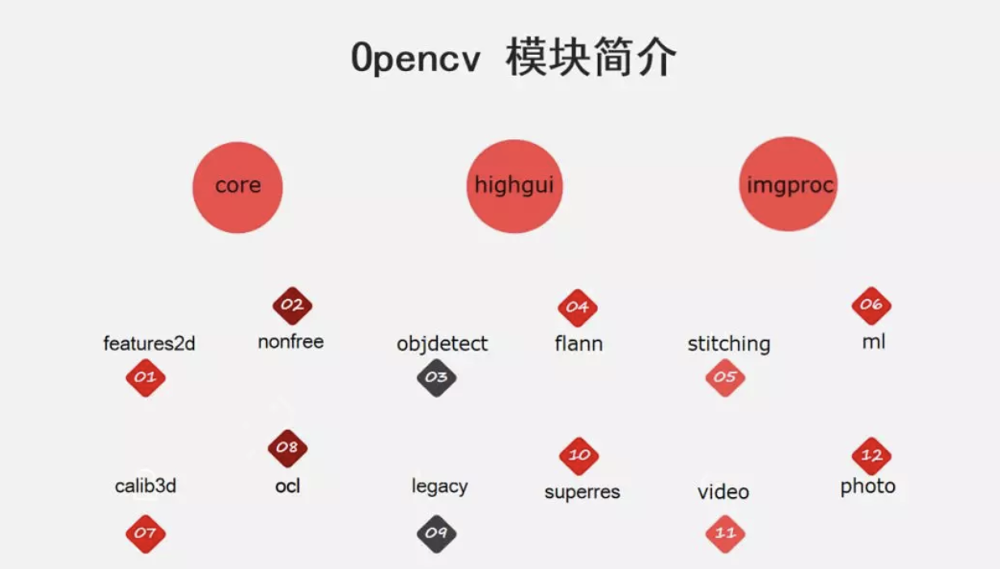

# OpenCV的模块及数据结构

**学习目标**

- 了解OpenCV的主要模块
- 熟练掌握OpenCV的数据结构

# 1 OpenCV的模块

下图列出了OpenCV中包含的各个模块：

其中core、highgui、imgproc是最基础的模块，该课程主要是围绕这几个模块展开的，分别介绍如下：

- **core模块**实现了最核心的数据结构及其基本运算，如绘图函数、数组操作相关函数以及与OpenGL的交互操作等。
- **highgui模块**实现了视频与图像的读取、显示、存储等接口。
- **imgproc模块**实现了图像处理的基础方法，包括图像滤波、图像的几何变换、平滑、阈值分割、形态学处理、边缘检测、目标检测、运动分析和对象跟踪等。

对于图像处理其他更高层次的方向及应用，OpenCV也有相关的模块实现

- **features2d模块**用于提取图像特征以及特征匹配，nonfree模块实现了一些专利算法，如sift特征。
- **objdetect模块**实现了一些目标检测的功能，经典的基于Haar、LBP特征的人脸检测，基于HOG的行人、汽车等目标检测，分类器使用Cascade Classification（级联分类）和Latent SVM等。
- **stitching模块**实现了图像拼接功能。
- **FLANN模块**（Fast Library for Approximate Nearest Neighbors），包含快速近似最近邻搜索FLANN
  和聚类Clustering算法。
- **ml模块**机器学习模块（SVM，决策树，Boosting等等）。
- **photo模块**包含图像修复和图像去噪两部分。
- **video模块**针对视频处理，如背景分离，前景检测、对象跟踪等。
- **calib3d模块**即Calibration（校准）3D，这个模块主要是相机校准和三维重建相关的内容。包含了基本的多视角几何算法，单个立体摄像头标定，物体姿态估计，立体相似性算法，3D信息的重建等等。
- **G-API模块**包含超高效的图像处理pipeline引擎

# 2 OpenCV的数据结构

- OpenCV提供了多种基本的数据类型，常用的数据结构有以下几种:
  - **Mat类**
  - **Point类**
  - **Size类**
  - **Rect类**
  - **Scalar类**
  - **Vec类**
  - **Range类**

下面我们重点说一下MAT类。

## 2.1 Mat类

要熟练使用OpenCV，最重要的就是学会Mat数据结构，在OpenCV中Mat被定义为一个类，把它看作一个数据结构，以矩阵的形式来存储数据的。

Mat的常见属性：

- dims：表示矩阵M的维度，如2$*$3的矩阵为2维，3$*$4$*$5的矩阵为3维
- data：uchar型的指针，指向内存中存放矩阵数据的一块内存
- rows, cols：矩阵的行数、列数
- type：表示了矩阵中元素的类型(depth)与矩阵的通道个数(channels)；命名规则为CV_ + (位数）+（数据类型）+（通道数）
  其中：U（unsigned integer）-- 无符号整数
  S（signed integer）-- 有符号整数
  F（float）-- 浮点数
  例如CV_8UC3，可拆分为：CV_：type的前缀,
  8U：8位无符号整数(depth)，C3：3通道(channels)
- depth：即图像每一个像素的位数(bits)；这个值和type是相关的。例如CV_8UC3中depth则是CV_8U。
- channels：通道数量，若图像为RGB、HSV等三通道图像，则channels = 3；若图像为灰度图，则为单通道，则channels = 1
- elemSize：矩阵中每一个元素的数据大小
  elemSize = channels * depth / 8 ，例如：type是CV_8UC3，elemSize = 3 * 8 / 8 = 3bytes
- elemSize1：单通道的矩阵元素占用的数据大小，elemSize1 = depth / 8，例如：type是CV_8UC3，elemSize1 = 8 / 8 = 1bytes

## 2.2 其他数据类型

1.**点Point类**

包含两个整型数据成员x和y，即坐标点

2.**尺寸Size类**

数据成员是width和height，一般用来表示图像的大小，或者矩阵的大小

3.**矩形Rect类**

数据成员x,y,width,height，分别代表这个矩形左上角的坐标点和矩形的宽度和高度

4.**颜色Scalar类**

Scalar_(_Tp v0, _Tp v1, _Tp v2=0, _Tp v3=0)

这个默认构造函数的四个参数分别表示RGB+Alpha颜色中的:

v0---表示RGB中的B（蓝色）分量

v1---表示RGB中的G（绿色）分量

v2---表示RGB中的R（红色）分量

v3---表示Alpha是透明色分量

5.**向量Vec类**

一个“一维矩阵”

Vec<int,n>---就是用类型int和向量模板类做一个实例化。其中第一个参数int表示Vec中存储的为int类型；第二个参数n为一个整型值，表示Vec每个对象中存储n个int值，也就是n维向量(列向量)

6.**Range类**

用于指定一个连续的子序列，例如一个轮廓的一部分，或者一个矩阵的列空间

**总结**

1. OpenCV 的模块主要有core, highgui, imgproc

2. OpenCV中的数据结构有：

   Mat类（熟悉）

   Point类

   Size类

   Rect类

   Scalar类

   Vec类

   Range类（其他了解）

