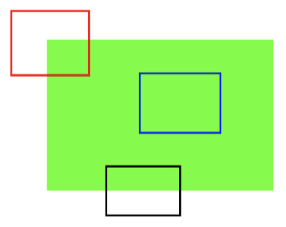

# 角点特征

**学习目标**

- 理解图像的特征
- 知道图像的角点

# 1 图像的特征

大多数人都玩过拼图游戏。首先拿到完整图像的碎片，然后把这些碎片以正确的方式排列起来从而重建这幅图像。如果把拼图游戏的原理写成计算机程序，那计算机就也会玩拼图游戏了。

在拼图时，我们要寻找一些唯一的特征，这些特征要适于被跟踪，容易被比较。我们在一副图像中搜索这样的特征，找到它们，而且也能在其他图像中找到这些特征，然后再把它们拼接到一起。我们的这些能力都是天生的。

那这些特征是什么呢？我们希望这些特征也能被计算机理解。

如果我们深入的观察一些图像并搜索不同的区域，以下图为例：

在图像的上方给出了六个小图。找到这些小图在原始图像中的位置。你能找到多少正确结果呢？

A 和 B 是平面，而且它们的图像中很多地方都存在。很难找到这些小图的准确位置。

C 和 D 也很简单。它们是建筑的边缘。可以找到它们的近似位置，但是准确位置还是很难找到。这是因为：沿着边缘，所有的地方都一样。所以边缘是比平面更好的特征，但是还不够好。

最后 E 和 F 是建筑的一些角点。它们能很容易的被找到。因为在角点的地方，无论你向哪个方向移动小图，结果都会有很大的不同。所以可以把它们当 成一个好的特征。为了更好的理解这个概念我们再举个更简单的例子。

如上图所示，蓝色框中的区域是一个平面很难被找到和跟踪。无论向哪个方向移动蓝色框，都是一样的。对于黑色框中的区域，它是一个边缘。如果沿垂直方向移动，它会改变。但是如果沿水平方向移动就不会改变。而红色框中的角点，无论你向那个方向移动，得到的结果都不同，这说明它是唯一的。 所以，我们说角点是一个好的图像特征，也就回答了前面的问题。

角点是图像很重要的特征,对图像图形的理解和分析有很重要的作用。角点在三维场景重建运动估计，目标跟踪、目标识别、图像配准与匹配等计算机视觉领域起着非常重要的作用。在现实世界中，角点对应于物体的拐角，道路的十字路口、丁字路口等

那我们怎样找到这些角点呢？接下来我们使用 OpenCV 中的各种算法来查找图像的特征，并对它们进行描述。

**总结**

1. 图像特征

   图像特征要有区分性，容易被比较。一般认为角点，斑点等是较好的图像特征

   特征检测：找到图像中的特征

   特征描述：对特征及其周围的区域进行描述
