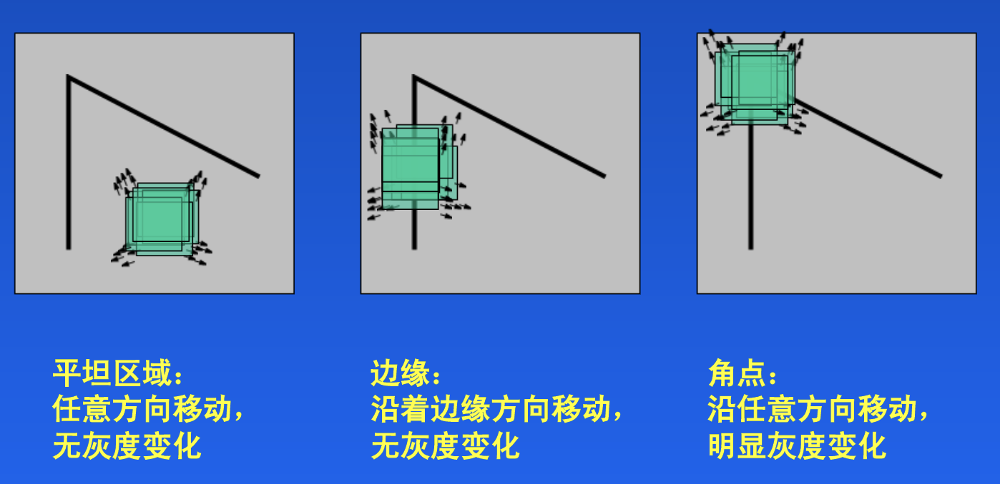
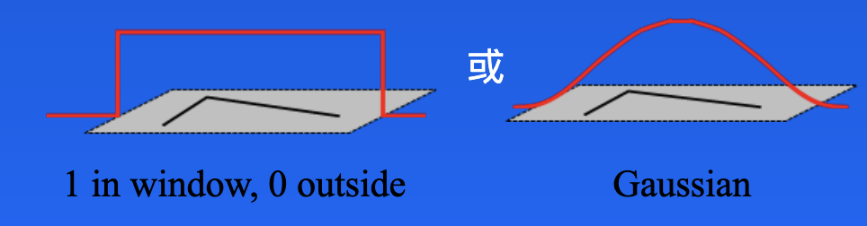
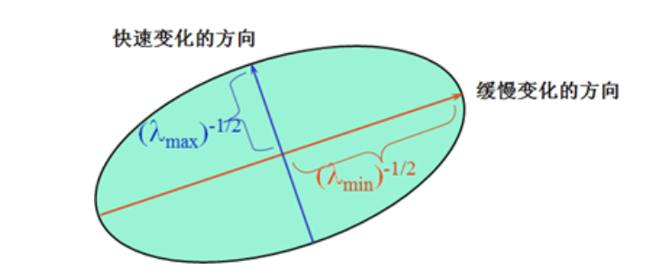
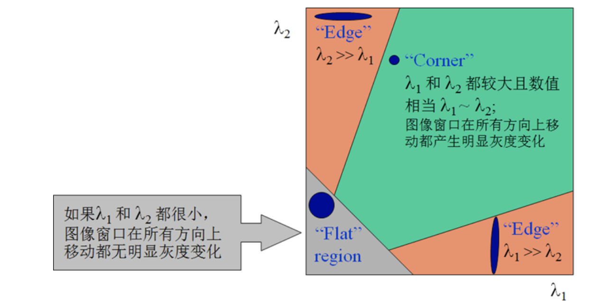
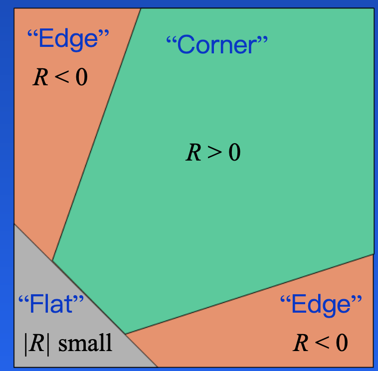
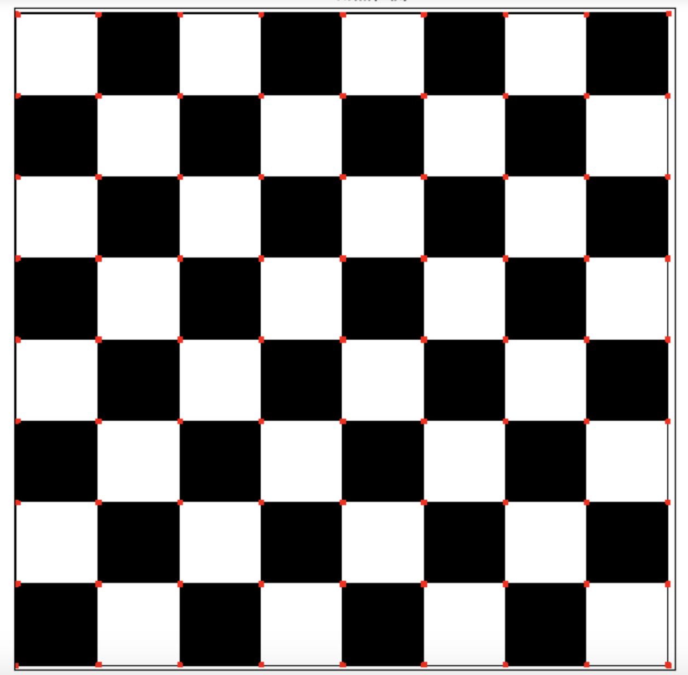
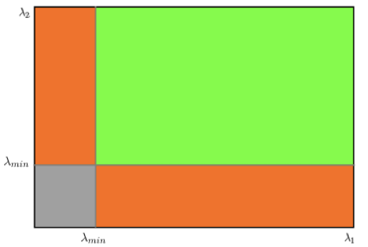
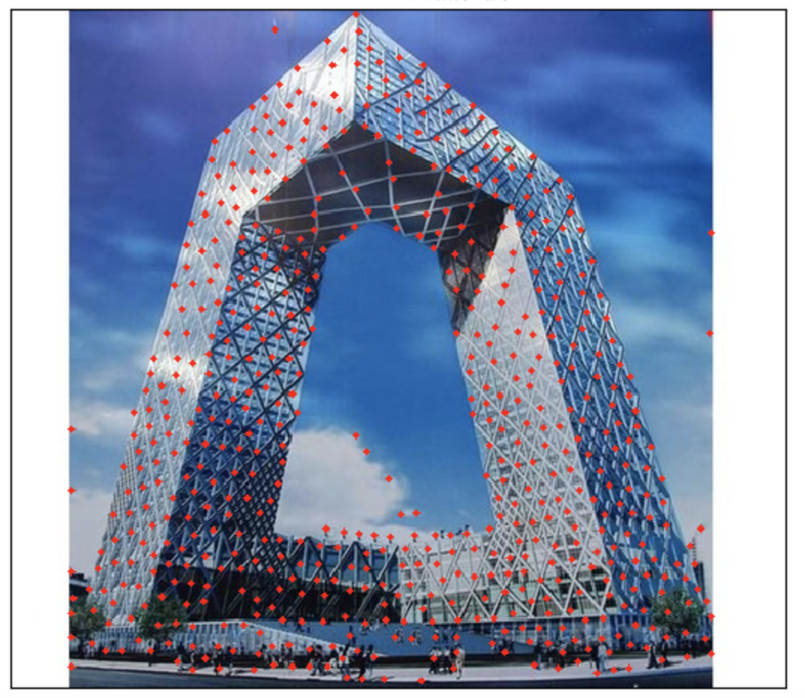

# Harris和Shi-Tomas算法

**学习目标**

- 理解Harris和Shi-Tomasi算法的原理
- 能够利用Harris和Shi-Tomasi进行角点检测

# 1 Harris角点检测

## 1.1 原理

Harris角点检测的思想是通过图像的局部的小窗口观察图像，角点的特征是窗口沿任意方向移动都会导致图像灰度的明显变化，如下图所示：



将上述思想转换为数学形式，即将局部窗口向各个方向移动$$(u,v)$$并计算所有灰度差异的总和，表达式如下：
$$
E(u,v)=\sum_{x,y}w(x,y)[I(x+u,y+v)-I(x,y)]^2
$$
其中$$I(x,y)$$是局部窗口的图像灰度，$$I(x+u,y+v)$$是平移后的图像灰度，$$w(x,y)$$是窗口函数，该可以是矩形窗口，也可以是对每一个像素赋予不同权重的高斯窗口，如下所示：



角点检测中使$$E(u,v)$$的值最大。利用一阶泰勒展开有：
$$
I(x+u,y+v)=I(x,y)+I_xu+I_yv
$$
其中$$I_x 和 I_y$$ 是沿x和y方向的导数，可用sobel算子计算。

推导如下：
$$
E(u,v)=\sum_{x,y}w(x,y)[I(x+u,y+v)-I(x,y)]^2\\=\sum_{x,y}w(x,y)[I(x,y)+I_xu+I_yv-I(x,y)]^2\\=\sum_{x,y}w(x,y)[I_{x}^2u^2+2I_xI_yuv+I_{y}^2v^2]\\=\sum_{x,y}w(x,y)\left[\begin{matrix}u,v\end{matrix}\right]\left[\begin{matrix}I_x^2,I_xI_y\\I_xI_y,I_y^2\end{matrix}\right]\left[\begin{matrix}u\\v\end{matrix}\right]\\=\left[\begin{matrix}u,v\end{matrix}\right]\sum_{x,y}w(x,y)\left[\begin{matrix}I_x^2,I_xI_y\\I_xI_y,I_y^2\end{matrix}\right]\left[\begin{matrix}u\\v\end{matrix}\right]\\=\left[\begin{matrix}u,v\end{matrix}\right]M\left[\begin{matrix}u\\v\end{matrix}\right]
$$
$$M$$矩阵决定了$$E(u,v)$$的取值，下面我们利用$$M$$来求角点，$$M$$是$$I_x 和 I_y$$的二次项函数，可以表示成椭圆的形状，椭圆的长短半轴由$$M$$的特征值$$\lambda_1和\lambda_2$$决定，方向由特征矢量决定，如下图所示：



椭圆函数特征值与图像中的角点、直线（边缘）和平面之间的关系如下图所示。



共可分为三种情况：

- 图像中的直线。一个特征值大，另一个特征值小，$$𝜆_1≫𝜆_2$$或$$λ_2≫λ_1$$。椭圆函数值在某一方向上大，在其他方向上小。
- 图像中的平面。两个特征值都小，且近似相等；椭圆函数数值在各个方向上都小。
- 图像中的角点。两个特征值都大，且近似相等，椭圆函数在所有方向都增大

Harris给出的角点计算方法并不需要计算具体的特征值，而是计算一个**角点响应值$$R$$**来判断角点。$$R$$的计算公式为：
$$
𝑅=𝑑𝑒𝑡𝑀−𝛼(𝑡𝑟𝑎𝑐𝑒𝑀)^2
$$
式中，$$𝑑𝑒𝑡𝑀$$为矩阵𝑀的行列式；𝑡𝑟𝑎𝑐𝑒𝑀为矩阵𝑀的迹；α为常数，取值范围为0.04~0.06。事实上，特征是隐含在𝑑𝑒𝑡𝑀和𝑡𝑟𝑎𝑐𝑒𝑀中，因为:
$$
𝑑𝑒𝑡𝑀=𝜆_1𝜆_2\\𝑡𝑟𝑎𝑐𝑒𝑀=𝜆_1+𝜆_2
$$
那我们怎么判断角点呢？如下图所示：

- 当R为大数值的正数时是角点
- 当R为大数值的负数时是边界
- 当R为小数是认为是平坦区域

## 1.2 实现

在OpenCV中实现Hariis检测使用的API是：

```python
dst=cv.cornerHarris(src, blockSize, ksize, k) 
```

参数：

- img：数据类型为 float32 的输入图像。

- blockSize：角点检测中要考虑的邻域大小。

- ksize：sobel求导使用的核大小

- k ：角点检测方程中的自由参数，取值参数为 [0.04，0.06].

示例：

```python
import cv2 as cv
import numpy as np 
import matplotlib.pyplot as plt
# 1 读取图像，并转换成灰度图像
img = cv.imread('./image/chessboard.jpg')
gray = cv.cvtColor(img, cv.COLOR_BGR2GRAY)
# 2 角点检测
# 2.1 输入图像必须是 float32
gray = np.float32(gray)

# 2.2 最后一个参数在 0.04 到 0.05 之间
dst = cv.cornerHarris(gray,2,3,0.04)
# 3 设置阈值，将角点绘制出来，阈值根据图像进行选择
img[dst>0.001*dst.max()] = [0,0,255]
# 4 图像显示
plt.figure(figsize=(10,8),dpi=100)
plt.imshow(img[:,:,::-1]),plt.title('Harris角点检测')
plt.xticks([]), plt.yticks([])
plt.show()
```

结果如下：



Harris角点检测的优缺点：

优点：

- 旋转不变性，椭圆转过一定角度但是其形状保持不变（特征值保持不变）
- 对于图像灰度的仿射变化具有部分的不变性，由于仅仅使用了图像的一介导数，对于图像灰度平移变化不变；对于图像灰度尺度变化不变

缺点：

- 对尺度很敏感，不具备几何尺度不变性。
- 提取的角点是像素级的

# 2 Shi-Tomasi角点检测

## 2.1 原理

Shi-Tomasi算法是对Harris角点检测算法的改进，一般会比Harris算法得到更好的角点。Harris 算法的角点响应函数是将矩阵 M 的行列式值与 M 的迹相减，利用差值判断是否为角点。后来Shi 和Tomasi 提出改进的方法是，若矩阵M的两个特征值中较小的一个大于阈值，则认为他是角点，即：
$$
R= min(\lambda_1,\lambda_2)
$$
如下图所示：



从这幅图中，可以看出来只有当 λ 1 和 λ 2 都大于最小值时，才被认为是角点。

## 2.2 实现

在OpenCV中实现Shi-Tomasi角点检测使用API:

```python
corners = cv2.goodFeaturesToTrack ( image, maxcorners, qualityLevel, minDistance )
```

参数：

- Image: 输入灰度图像
- maxCorners : 获取角点数的数目。
- qualityLevel：该参数指出最低可接受的角点质量水平，在0-1之间。 
- minDistance：角点之间最小的欧式距离，避免得到相邻特征点。

返回：

- Corners: 搜索到的角点，在这里所有低于质量水平的角点被排除掉，然后把合格的角点按质量排序，然后将质量较好的角点附近（小于最小欧式距离）的角点删掉，最后找到maxCorners个角点返回。

**示例：**

```python
import numpy as np 
import cv2 as cv
import matplotlib.pyplot as plt
# 1 读取图像
img = cv.imread('./image/tv.jpg') 
gray = cv.cvtColor(img,cv.COLOR_BGR2GRAY)
# 2 角点检测
corners = cv.goodFeaturesToTrack(gray,1000,0.01,10)  
# 3 绘制角点
for i in corners:
    x,y = i.ravel()
    cv.circle(img,(x,y),2,(0,0,255),-1)
# 4 图像展示
plt.figure(figsize=(10,8),dpi=100)
plt.imshow(img[:,:,::-1]),plt.title('shi-tomasi角点检测')
plt.xticks([]), plt.yticks([])
plt.show()
```

结果如下：



**总结**

1. Harris算法

   思想：通过图像的局部的小窗口观察图像，角点的特征是窗口沿任意方向移动都会导致图像灰度的明显变化。

   API: cv.cornerHarris()

2. Shi-Tomasi算法

   对Harris算法的改进，能够更好地检测角点

   API: cv2.goodFeatureToTrack()