# SIFT/SURF算法

**学习目标**

- 理解SIFT/SURF算法的原理，
- 能够使用SIFT/SURF进行关键点的检测

# 1 SIFT/SURF算法

## 1.1 SIFT原理

前面两节我们介绍了Harris和Shi-Tomasi角点检测算法，这两种算法具有旋转不变性，但不具有尺度不变性，以下图为例，在左侧小图中可以检测到角点，但是图像被放大后，在使用同样的窗口，就检测不到角点了。

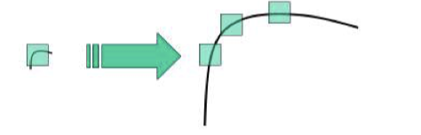

所以，下面我们来介绍一种计算机视觉的算法，尺度不变特征转换即SIFT (Scale-invariant feature transform)。它用来侦测与描述影像中的局部性特征，它在空间尺度中寻找极值点，并提取出其位置、尺度、旋转不变量，此算法由 David Lowe在1999年所发表，2004年完善总结。

   	其应用范围包含物体辨识、机器人地图感知与导航、影像缝合、3D模型建立、手势辨识、影像追踪和动作比对等领域。

  	SIFT算法的实质是在不同的尺度空间上查找关键点(特征点)，并计算出关键点的方向。SIFT所查找到的关键点是一些十分突出，不会因光照，仿射变换和噪音等因素而变化的点，如**角点、边缘点、暗区的亮点及亮区的暗点**等。

### 1.1.1 基本流程

Lowe将SIFT算法分解为如下**四步**：

1. 尺度空间极值检测：搜索所有尺度上的图像位置。通过高斯差分函数来识别潜在的对于尺度和旋转不变的关键点。
2. 关键点定位：在每个候选的位置上，通过一个拟合精细的模型来确定位置和尺度。关键点的选择依据于它们的稳定程度。
3. 关键点方向确定：基于图像局部的梯度方向，分配给每个关键点位置一个或多个方向。所有后面的对图像数据的操作都相对于关键点的方向、尺度和位置进行变换，从而保证了对于这些变换的不变性。
4. 关键点描述：在每个关键点周围的邻域内，在选定的尺度上测量图像局部的梯度。这些梯度作为关键点的描述符，它允许比较大的局部形状的变形或光照变化。

我们就沿着Lowe的步骤，对SIFT算法的实现过程进行介绍：

### 1.1.2 尺度空间极值检测

在不同的尺度空间是不能使用相同的窗口检测极值点，对小的关键点使用小的窗口，对大的关键点使用大的窗口，为了达到上述目的，我们使用尺度空间滤波器。

> 高斯核是唯一可以产生多尺度空间的核函数。-《Scale-space theory: A basic tool for analysing structures at different scales》。

  	一个图像的尺度空间$$L(x,y,σ)$$ ,定义为原始图像$$I(x,y)$$与一个可变尺度的2维高斯函数$$G(x,y,σ)$$卷积运算 ，即：
$$
  L(x,y,\sigma) = G(x,y,\sigma)* I(x,y)
$$
  其中：
$$
  G(x,y,\sigma)=\frac{1}{2\pi\sigma^2}e^{-\frac{x^2+y^2}{2\sigma^2}}
$$
  	$$\sigma$$是尺度空间因子，它决定了图像的模糊的程度。在大尺度下（$$\sigma$$值大）表现的是图像的概貌信息，在小尺度下（$$\sigma$$值小）表现的是图像的细节信息。

  	在计算高斯函数的离散近似时，在大概**3σ**距离之外的像素都可以看作不起作用，这些像素的计算也就可以忽略。所以，在实际应用中，只计算**(6σ+1)\*(6σ+1)**的高斯卷积核就可以保证相关像素影响。

  	下面我们构建图像的高斯金字塔，它采用高斯函数对图像进行模糊以及降采样处理得到的，高斯金字塔构建过程中，首先将图像扩大一倍，在扩大的图像的基础之上构建高斯金字塔，然后对该尺寸下图像进行高斯模糊，几幅模糊之后的图像集合构成了一个Octave，然后对该Octave下选择一幅图像进行下采样，长和宽分别缩短一倍，图像面积变为原来四分之一。这幅图像就是下一个Octave的初始图像，在初始图像的基础上完成属于这个Octave的高斯模糊处理，以此类推完成整个算法所需要的所有八度构建，这样这个高斯金字塔就构建出来了，整个流程如下图所示：

  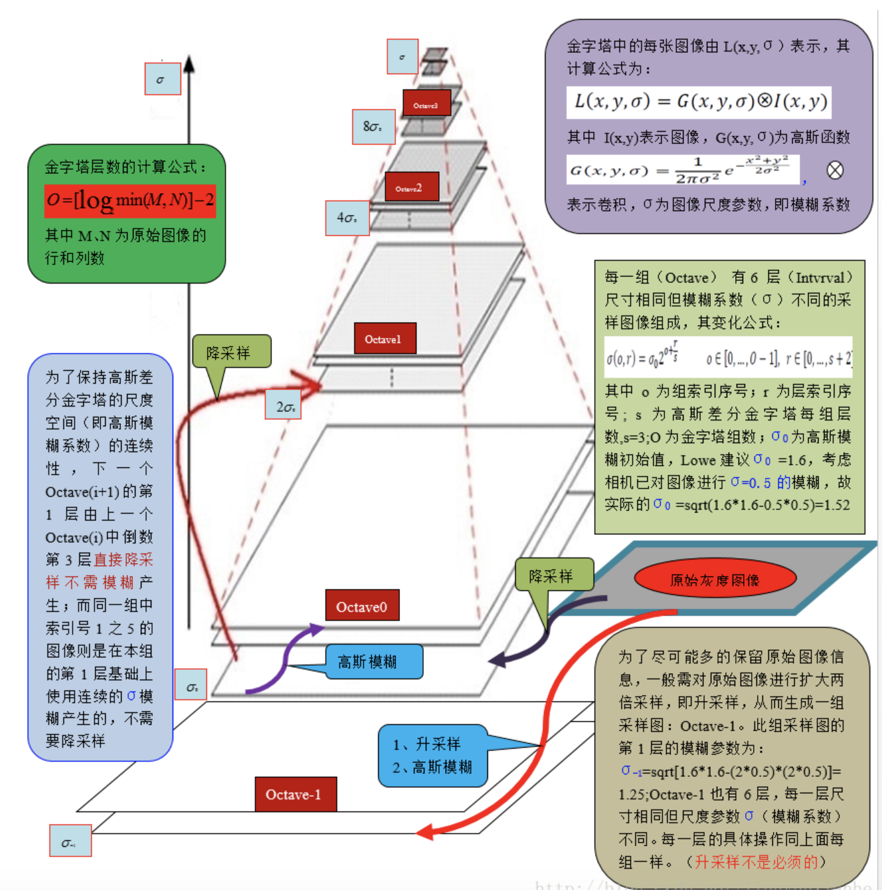

  	利用LoG(高斯拉普拉斯方法)，即图像的二阶导数，可以在不同的尺度下检测图像的关键点信息，从而确定图像的特征点。但LoG的计算量大，效率低。所以我们通过两个相邻高斯尺度空间的图像的相减，得到DoG(高斯差分)来近似LoG。

  	为了计算DoG我们构建高斯差分金字塔，该金字塔是在上述的高斯金字塔的基础上构建而成的，建立过程是：在高斯金字塔中每个Octave中相邻两层相减就构成了高斯差分金字塔。如下图所示：

  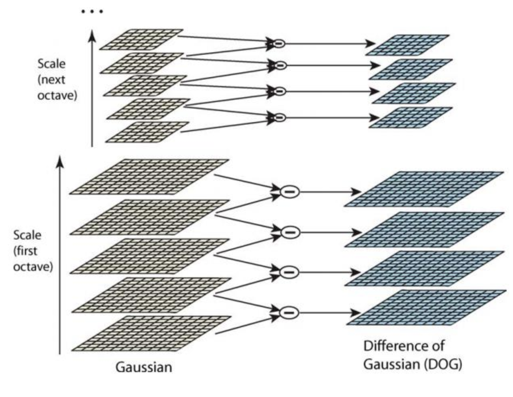

  高斯差分金字塔的第1组第1层是由高斯金字塔的第1组第2层减第1组第1层得到的。以此类推，逐组逐层生成每一个差分图像，所有差分图像构成差分金字塔。概括为DOG金字塔的第o组第l层图像是有高斯金字塔的第o组第l+1层减第o组第l层得到的。后续Sift特征点的提取都是在DOG金字塔上进行的

  	在 DoG 搞定之后，就可以在不同的尺度空间中搜索局部最大值了。对于图像中的一个像素点而言，它需要与自己周围的 8 邻域，以及尺度空间中上下两层中的相邻的 18（2x9）个点相比。如果是局部最大值，它就可能是一个关键点。基本上来说关键点是图像在相应尺度空间中的最好代表。如下图所示：

  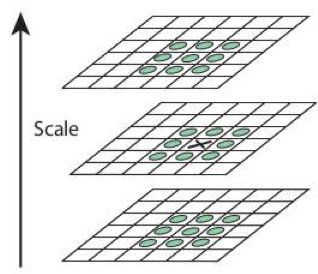

  一般来说，在构建金字塔时，octave设为4，每个octave中的层数为5。

### 1.1.3 关键点定位

由于DoG对噪声和边缘比较敏感，因此在上面高斯差分金字塔中检测到的局部极值点需经过进一步的检验才能精确定位为特征点。

使用尺度空间的泰勒级数展开来获得极值的准确位置， 如果**极值点的 灰度值小于阈值**（一般为0.03或0.04）就会被忽略掉。 在 OpenCV 中这种阈值被称为 contrastThreshold。

DoG 算法对边界非常敏感， 所以我们必须要把边界去除。 Harris 算法除了可以用于角点检测之外还可以用于检测边界。从 Harris 角点检测的算法中，当一个特征值远远大于另外一个特征值时检测到的是边界。那在DoG算法中欠佳的关键点在平行边缘的方向有较大的主曲率，而在垂直于边缘的方向有较小的曲率，两者的比值如果高于某个阈值（在OpenCV中叫做边界阈值），就认为该关键点为边界，将被忽略，一般将该阈值设置为10。

将低对比度和边界的关键点去除，得到的就是我们感兴趣的关键点。

### 1.1.4 关键点方向确定

经过上述两个步骤，图像的关键点就完全找到了，这些关键点具有尺度不变性。为了实现旋转不变性，还需要为每个关键点分配一个方向角度，也就是根据检测到的关键点所在高斯尺度图像的邻域结构中求得一个方向基准。

对于任一关键点，我们采集其所在高斯金字塔图像以r为半径的区域内所有像素的梯度特征（幅值和幅角），半径r为：
$$
  r = 3\times1.5σ
$$
  其中σ是关键点所在octave的图像的尺度。

  梯度的幅值和方向的计算公式为：
$$
  m(x,y)=\sqrt{(L(x+1,y)-L(x-1,y)^2+(L(x,y+1)-L(x,y-1))^2}
$$

$$
\theta(x,y) = arctan(\frac{L(x,y+1)-L(x,y-1)}{L(x+1,y)-L(x-1),y})
$$

  	邻域像素梯度的计算结果如下图所示：

  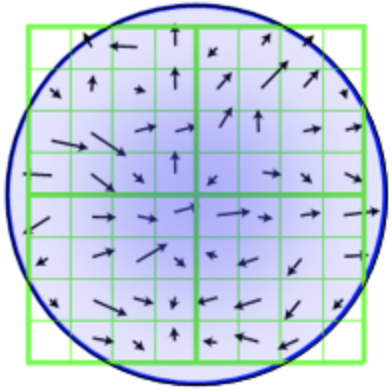

  	完成关键点梯度计算后，使用直方图统计关键点邻域内像素的梯度幅值和方向。具体做法是，将360°分为36柱，每10°为一柱，然后在以r为半径的区域内，将梯度方向在某一个柱内的像素找出来，然后将他们的幅值相加在一起作为柱的高度。因为在r为半径的区域内像素的梯度幅值对中心像素的贡献是不同的，因此还需要对幅值进行加权处理，采用高斯加权，方差为1.5σ。如下图所示，为简化图中只画了8个方向的直方图。

  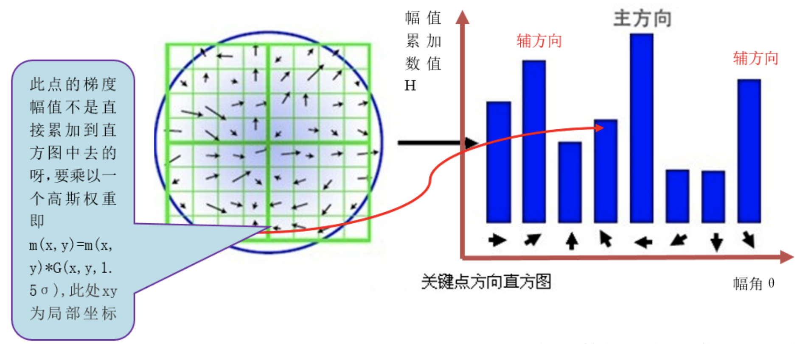

  	每个特征点必须分配一个主方向，还需要一个或多个辅方向，增加辅方向的目的是为了增强图像匹配的鲁棒性。辅方向的定义是，当一个柱体的高度大于主方向柱体高度的80%时，则该柱体所代表的的方向就是给特征点的辅方向。

  	直方图的峰值，即最高的柱代表的方向是特征点邻域范围内图像梯度的主方向，但该柱体代表的角度是一个范围，所以我们还要对离散的直方图进行插值拟合，以得到更精确的方向角度值。利用抛物线对离散的直方图进行拟合，如下图所示：

  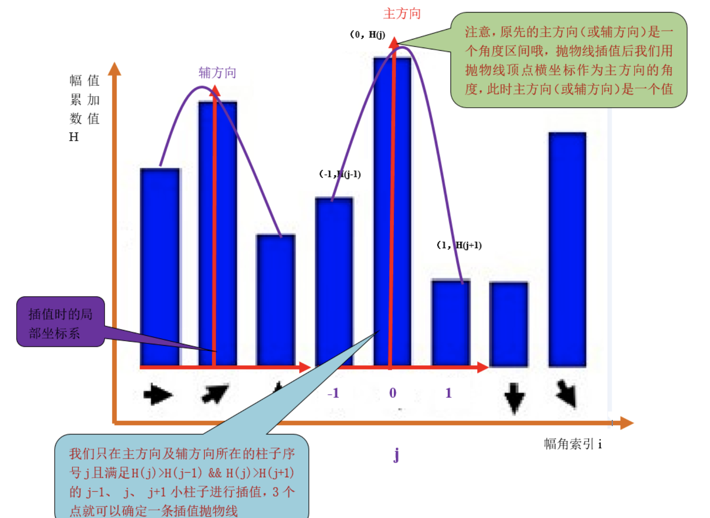

### 1.1.5 关键点描述

通过以上步骤，每个关键点就被分配了位置，尺度和方向信息。接下来我们为每个关键点建立一个描述符，该描述符既具有可区分性，又具有对某些变量的不变性，如光照，视角等。而且描述符不仅仅包含关键点，也包括关键点周围对其有贡献的的像素点。主要思路就是通过将关键点周围图像区域分块，计算块内的梯度直方图，生成具有特征向量，对图像信息进行抽象。

描述符与特征点所在的尺度有关，所以我们在关键点所在的高斯尺度图像上生成对应的描述符。以特征点为中心，将其附近邻域划分为$$d*d$$个子区域（一般取d=4)，每个子区域都是一个正方形，边长为3σ，考虑到实际计算时，需进行三次线性插值，所以特征点邻域的为$$3\sigma(d+1)*3\sigma(d+1)$$的范围，如下图所示：

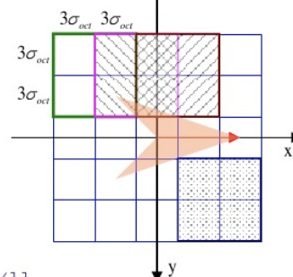

为了保证特征点的旋转不变性，以特征点为中心，将坐标轴旋转为关键点的主方向，如下图所示：

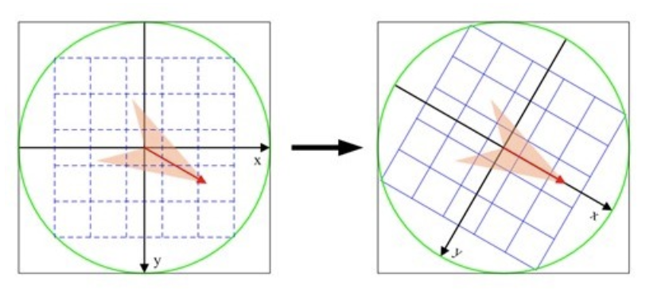

计算子区域内的像素的梯度，并按照σ=0.5d进行高斯加权，然后插值计算得到每个种子点的八个方向的梯度，插值方法如下图所示：

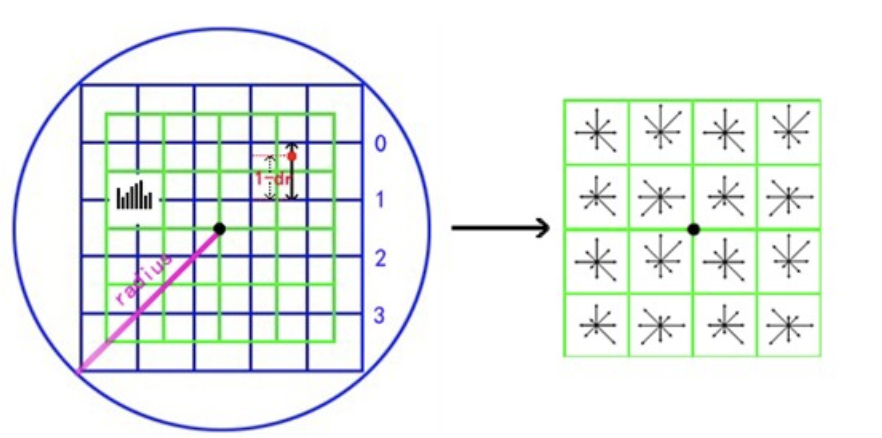


每个种子点的梯度都是由覆盖其的4个子区域插值而得的。如图中的红色点，落在第0行和第1行之间，对这两行都有贡献。对第0行第3列种子点的贡献因子为dr，对第1行第3列的贡献因子为1-dr，同理，对邻近两列的贡献因子为dc和1-dc，对邻近两个方向的贡献因子为do和1-do。则最终累加在每个方向上的梯度大小为：
$$
weight = w*dr^k(1-dr)^{(1-k)}dc^m(1-dc)^{1-m}do^n(1-do)^{1-n}
$$
其中k，m，n为0或为1。
如上统计$$4*4*8=128$$个梯度信息即为该关键点的特征向量，按照特征点的对每个关键点的特征向量进行排序，就得到了SIFT特征描述向量。

### 1.1.6 总结

SIFT在图像的不变特征提取方面拥有无与伦比的优势，但并不完美，仍然存在实时性不高，有时特征点较少，对边缘光滑的目标无法准确提取特征点等缺陷，自SIFT算法问世以来，人们就一直对其进行优化和改进，其中最著名的就是SURF算法。


## 1.2 SURF原理

使用 SIFT 算法进行关键点检测和描述的执行速度比较慢， 需要速度更快的算法。  2006 年 Bay提出了 SURF 算法，是SIFT算法的增强版，它的计算量小，运算速度快，提取的特征与SIFT几乎相同，将其与SIFT算法对比如下：

|            | SIFT                                                       | SURF                                                         |
| ---------- | :--------------------------------------------------------- | ------------------------------------------------------------ |
| 特征点检测 | 使用不同尺度的图片与高斯函数进行卷积                       | 使用不同大小的盒滤波器与原始图像做卷积，易于并行             |
| 方向       | 关键点邻接矩形区域内，利用梯度直方图计算                   | 关键点邻接圆域内，计算x,y方向的haar小波                      |
| 描述符生成 | 关键点邻域内划分d*d子区域，每个子区域内计算8个方向的直方图 | 关键点邻域内划分d*d个子区域，每个子区域计算采样点的haar小波响应，记录：$$\sum{dx},\sum{dy},\sum{|dx|},\sum{|dy|}$$ |
|            |                                                            |                                                              |

## 1.3 实现

在OpenCV中利用SIFT检测关键点的流程如下所示：

1. 实例化sift

```python
sift = cv.xfeatures2d.SIFT_create()
```

1. 利用sift.detectAndCompute()检测关键点并计算

```python
kp,des = sift.detectAndCompute(gray,None)
```

参数：

- gray: 进行关键点检测的图像，注意是灰度图像

返回：

- kp: 关键点信息，包括位置，尺度，方向信息
- des: 关键点描述符，每个关键点对应128个梯度信息的特征向量

1. 将关键点检测结果绘制在图像上

   ```python
   cv.drawKeypoints(image, keypoints, outputimage, color, flags)
   ```

   参数：

   - image: 原始图像
   - keypoints：关键点信息，将其绘制在图像上
   - outputimage：输出图片，可以是原始图像
   - color：颜色设置，通过修改（b,g,r）的值,更改画笔的颜色，b=蓝色，g=绿色，r=红色。
   - flags：绘图功能的标识设置
     1. cv2.DRAW_MATCHES_FLAGS_DEFAULT：创建输出图像矩阵，使用现存的输出图像绘制匹配对和特征点，对每一个关键点只绘制中间点
     2. cv2.DRAW_MATCHES_FLAGS_DRAW_OVER_OUTIMG：不创建输出图像矩阵，而是在输出图像上绘制匹配对
     3. cv2.DRAW_MATCHES_FLAGS_DRAW_RICH_KEYPOINTS：对每一个特征点绘制带大小和方向的关键点图形
     4. cv2.DRAW_MATCHES_FLAGS_NOT_DRAW_SINGLE_POINTS：单点的特征点不被绘制

SURF算法的应用与上述流程是一致，这里就不在赘述。

示例：

利用SIFT算法在中央电视台的图片上检测关键点，并将其绘制出来：

```python
import cv2 as cv 
import numpy as np
import matplotlib.pyplot as plt

img = cv.imread('./image/tv.jpg')
gray= cv.cvtColor(img,cv.COLOR_BGR2GRAY)

# 实例化sift对象
sift = cv.xfeatures2d.SIFT_create()

# 关键点检测：kp关键点信息包括方向，尺度，位置信息，des是关键点的描述符
kp,des=sift.detectAndCompute(gray,None)
# 在图像上绘制关键点的检测结果
cv.drawKeypoints(img,kp,img,flags=cv.DRAW_MATCHES_FLAGS_DRAW_RICH_KEYPOINTS)

plt.figure(figsize=(8,6),dpi=100)
plt.imshow(img[:,:,::-1]),plt.title('sift检测')
plt.xticks([]), plt.yticks([])
plt.show()
```

结果：

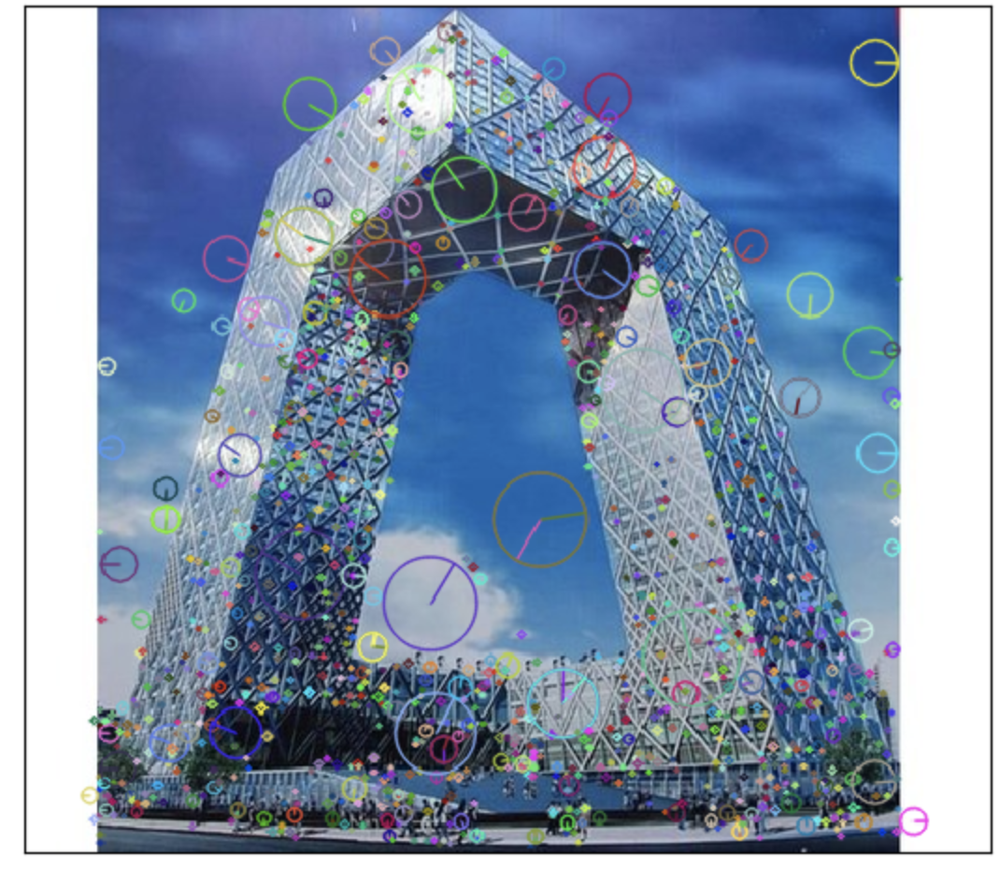


**总结**

SIFT原理：

- 尺度空间极值检测：构建高斯金字塔，高斯差分金字塔，检测极值点。

- 关键点定位：去除对比度较小和边缘对极值点的影响。

- 关键点方向确定：利用梯度直方图确定关键点的方向。

- 关键点描述：对关键点周围图像区域分块，计算块内的梯度直方图，生成具有特征向量，对关键点信息进行描述。

API：cv.xfeatures2d.SIFT_create()

SURF算法：

对SIFT算法的改进，在尺度空间极值检测，关键点方向确定，关键点描述方面都有改进，提高效率