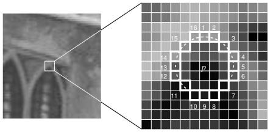

# Fast和ORB算法

**学习目标**

- 理解Fast算法角点检测的原理，能够完成角点检测
- 理解ORB算法的原理，能够完成特征点检测

# 1 Fast算法

## 1.1 原理

我们前面已经介绍过几个特征检测器，它们的效果都很好，特别是SIFT和SURF算法，但是从实时处理的角度来看，效率还是太低了。为了解决这个问题，Edward Rosten和Tom Drummond在2006年提出了FAST算法，并在2010年对其进行了修正。

**FAST** (全称Features from accelerated segment test)是一种用于角点检测的算法，该算法的原理是取图像中检测点，以该点为圆心的周围邻域内像素点判断检测点是否为角点，通俗的讲就是**若一个像素周围有一定数量的像素与该点像素值不同，则认为其为角点**。

### 1.1.1 **FAST算法的基本流程**

1. 在图像中选取一个像素点 p，来判断它是不是关键点。$I_p$等于像素点 p的灰度值。

2. 以r为半径画圆，覆盖p点周围的M个像素，通常情狂下，设置 r=3，则 M=16，如下图所示：

   

3. 设置一个阈值t，如果在这 16 个像素点中存在 n 个连续像素点的灰度值都高于$I_p + t$，或者低于$I_p - t$，那么像素点 p 就被认为是一个角点。如上图中的虚线所示，n 一般取值为 12。

4. 由于在检测特征点时是需要对图像中所有的像素点进行检测，然而图像中的绝大多数点都不是特征点，如果对每个像素点都进行上述的检测过程，那显然会浪费许多时间，因此采用一种进行**非特征点判别**的方法：首先对候选点的周围每个 90 度的点：1，9，5，13 进行测试（先测试 1 和 19, 如果它们符合阈值要求再测试 5 和 13）。如果 p 是角点，那么这四个点中至少有 3 个要符合阈值要求，否则直接剔除。对保留下来的点再继续进行测试（是否有 12 的点符合阈值要求）。 

虽然这个检测器的效率很高，但它有以下几条缺点：

- 获得的候选点比较多
- 特征点的选取不是最优的，因为它的效果取决与要解决的问题和角点的分布情况。
- 进行非特征点判别时大量的点被丢弃
- 检测到的很多特征点都是相邻的

前 3 个问题可以通过机器学习的方法解决，最后一个问题可以使用非最大值抑制的方法解决。

### **1.1.2机器学习的角点检测器**

1. 选择一组训练图片（最好是跟最后应用相关的图片）

2. 使用 FAST 算法找出每幅图像的特征点，对图像中的每一个特征点，将其周围的 16 个像素存储构成一个向量P。

   

3. 每一个特征点的 16 像素点都属于下列三类中的一种

   

4. 根据这些像素点的分类，特征向量 P 也被分为 3 个子集：Pd ，Ps ，Pb，

5. 定义一个新的布尔变量$K_p$，如果 p 是角点就设置为 Ture，如果不是就设置为 False。

6. 利用特征值向量p，目标值是$K_p$，训练ID3 树（决策树分类器）。

7. 将构建好的决策树运用于其他图像的快速的检测。

### 1.1.3 **非极大值抑制**


**在筛选出来的候选角点中有很多是紧挨在一起的，需要通过非极大值抑制来消除这种影响。**

为所有的候选角点都确定一个打分函数$$V $$ ， $$V $$的值可这样计算：先分别计算$$I_p$$与圆上16个点的像素值差值，取绝对值，再将这16个绝对值相加，就得到了$$V $$的值
$$
V = \sum_{i}^{16}|I_p-I_i|
$$
最后比较毗邻候选角点的 ![[公式]](https://www.zhihu.com/equation?tex=V) 值，把V值较小的候选角点pass掉。

FAST算法的思想与我们对角点的直观认识非常接近，化繁为简。FAST算法比其它角点的检测算法快，但是在噪声较高时不够稳定，这需要设置合适的阈值。

## 1.2 实现

OpenCV中的FAST检测算法是用传统方法实现的，

1. 实例化fast

```python
fast = =cv.FastFeatureDetector_create( threshold, nonmaxSuppression)
```

参数：

- threshold：阈值t，有默认值10
- nonmaxSuppression：是否进行非极大值抑制，默认值True

返回：

- Fast：创建的FastFeatureDetector对象

1. 利用fast.detect检测关键点，没有对应的关键点描述

```python
kp = fast.detect(grayImg, None)
```

参数：

- gray: 进行关键点检测的图像，注意是灰度图像

返回：

- kp: 关键点信息，包括位置，尺度，方向信息

1. 将关键点检测结果绘制在图像上，与在sift中是一样的

   ```python
   cv.drawKeypoints(image, keypoints, outputimage, color, flags)
   ```

示例：

```python
import numpy as np
import cv2 as cv
from matplotlib import pyplot as plt
# 1 读取图像
img = cv.imread('./image/tv.jpg')
# 2 Fast角点检测
# 2.1 创建一个Fast对象，传入阈值，注意：可以处理彩色空间图像
fast = cv.FastFeatureDetector_create(threshold=30)

# 2.2 检测图像上的关键点
kp = fast.detect(img,None)
# 2.3 在图像上绘制关键点
img2 = cv.drawKeypoints(img, kp, None, color=(0,0,255))

# 2.4 输出默认参数
print( "Threshold: {}".format(fast.getThreshold()) )
print( "nonmaxSuppression:{}".format(fast.getNonmaxSuppression()) )
print( "neighborhood: {}".format(fast.getType()) )
print( "Total Keypoints with nonmaxSuppression: {}".format(len(kp)) )


# 2.5 关闭非极大值抑制
fast.setNonmaxSuppression(0)
kp = fast.detect(img,None)

print( "Total Keypoints without nonmaxSuppression: {}".format(len(kp)) )
# 2.6 绘制为进行非极大值抑制的结果
img3 = cv.drawKeypoints(img, kp, None, color=(0,0,255))

# 3 绘制图像
fig,axes=plt.subplots(nrows=1,ncols=2,figsize=(10,8),dpi=100)
axes[0].imshow(img2[:,:,::-1])
axes[0].set_title("加入非极大值抑制")
axes[1].imshow(img3[:,:,::-1])
axes[1].set_title("未加入非极大值抑制")
plt.show()
```

结果：


# 2 ORB 算法

## 2.1 原理

SIFT和SURF算法是受专利保护的，在使用他们时我们是要付费的，但是ORB（Oriented Fast and Rotated Brief）不需要，它可以用来对图像中的关键点快速创建特征向量，并用这些特征向量来识别图像中的对象。

### 2.1.1 ORB算法流程

ORB算法结合了Fast和Brief算法，提出了构造金字塔，为Fast特征点添加了方向，从而使得关键点具有了尺度不变性和旋转不变性。具体流程描述如下：

1. 构造尺度金字塔，金字塔共有n层，与SIFT不同的是，每一层仅有一幅图像。第s层的尺度为：
   $$
   \sigma_s=\sigma_0^s
   $$
   $$\sigma_0$$是初始尺度，默认为1.2，原图在第0层。

   

   第s层图像的大小：
   $$
   SIZE = (H*\frac{1}{\sigma_s})\times(W*\frac{1}{\sigma_s})
   $$


1. 在不同的尺度上利用Fast算法检测特征点，采用Harris角点响应函数，根据角点的响应值排序，选取前N个特征点，作为本尺度的特征点。

2. 计算特征点的主方向，计算以特征点为圆心半径为r的圆形邻域内的灰度质心位置，将从特征点位置到质心位置的方向做特征点的主方向。

   计算方法如下:
   $$
   m_{pq}=\sum_{x,y}x^py^qI(x,y)
   $$
   质心位置：
   $$
   C=(\frac{m_{10}}{m_{00}},\frac{m_{01}}{m_{10}})
   $$
   主方向：
   $$
   \theta = arctan(m_{01},m_{10})
   $$

3. 为了解决旋转不变性，将特征点的邻域旋转到主方向上利用Brief算法构建特征描述符，至此就得到了ORB的特征描述向量。

### 2.1.2 BRIEF算法

 	BRIEF是一种特征描述子提取算法，并非特征点的提取算法，一种生成**二值**化描述子的算法，不提取代价低，匹配只需要使用简单的汉明距离(Hamming Distance)利用比特之间的异或操作就可以完成。因此，时间代价低，空间代价低，效果还挺好是最大的优点。

**算法的步骤介绍如下**：

1. **图像滤波**：原始图像中存在噪声时，会对结果产生影响，所以需要对图像进行滤波，去除部分噪声。

2. **选取点对**：以特征点为中心，取S*S的邻域窗口，在窗口内随机选取N组点对，一般N=128,256,512，默认是256，关于如何选取随机点对，提供了五种形式，结果如下图所示：

   -  x,y方向平均分布采样

   - x,y均服从Gauss(0,S^2/25)各向同性采样

   -  x服从Gauss(0,S^2/25)，y服从Gauss(0,S^2/100)采样

   -  x,y从网格中随机获取

   -  x一直在(0,0)，y从网格中随机选取

     

   图中一条线段的两个端点就是一组点对，其中第二种方法的结果比较好。

3. **构建描述符**：假设x,y是某个点对的两个端点，p(x),p(y)是两点对应的像素值，则有：
   $$
   t(x,y)=\begin{cases}1	&if p(x)>p(y)\\
   0&	else\end{cases}
   $$
   对每一个点对都进行上述的二进制赋值，形成BRIEF的关键点的描述特征向量，该向量一般为 128-512 位的字符串，其中仅包含 1 和 0，如下图所示：

   

## 2.2 实现

在OPenCV中实现ORB算法，使用的是：

1. 实例化ORB

```python
orb = cv.xfeatures2d.orb_create(nfeatures)
```

参数：

- nfeatures: 特征点的最大数量

1. 利用orb.detectAndCompute()检测关键点并计算

```python
kp,des = orb.detectAndCompute(gray,None)
```

参数：

- gray: 进行关键点检测的图像，注意是灰度图像

返回：

- kp: 关键点信息，包括位置，尺度，方向信息
- des: 关键点描述符，每个关键点BRIEF特征向量，二进制字符串，

2. 将关键点检测结果绘制在图像上

```python
cv.drawKeypoints(image, keypoints, outputimage, color, flags)
```

**示例：**

```python
import numpy as np
import cv2 as cv
from matplotlib import pyplot as plt
# 1 图像读取
img = cv.imread('./image/tv.jpg')

# 2 ORB角点检测
# 2.1 实例化ORB对象
orb = cv.ORB_create(nfeatures=500)
# 2.2 检测关键点,并计算特征描述符
kp,des = orb.detectAndCompute(img,None)

print(des.shape)

# 3 将关键点绘制在图像上
img2 = cv.drawKeypoints(img, kp, None, color=(0,0,255), flags=0)

# 4. 绘制图像
plt.figure(figsize=(10,8),dpi=100)
plt.imshow(img2[:,:,::-1])
plt.xticks([]), plt.yticks([])
plt.show()
```


**总结**

1. Fast算法

   原理：若一个像素周围有一定数量的像素与该点像素值不同，则认为其为角点

   API: cv.FastFeatureDetector_create()

2. ORB算法

   原理：是FAST算法和BRIEF算法的结合

   API：cv.ORB_create()