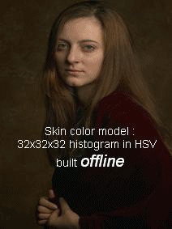

# 视频追踪

**学习目标**

- 理解meanshift的原理
- 知道camshift算法
- 能够使用meanshift和Camshift进行目标追踪

# 1.meanshift

## 1.1原理

	meanshift算法的原理很简单。假设你有一堆点集，还有一个小的窗口，这个窗口可能是圆形的，现在你可能要移动这个窗口到点集密度最大的区域当中。
如下图：


最开始的窗口是蓝色圆环的区域，命名为C1。蓝色圆环的圆心用一个蓝色的矩形标注，命名为C1_o。

而窗口中所有点的点集构成的质心在蓝色圆形点C1_r处，显然圆环的形心和质心并不重合。所以，移动蓝色的窗口，使得形心与之前得到的质心重合。在新移动后的圆环的区域当中再次寻找圆环当中所包围点集的质心，然后再次移动，通常情况下，形心和质心是不重合的。不断执行上面的移动过程，直到形心和质心大致重合结束。
这样，最后圆形的窗口会落到像素分布最大的地方，也就是图中的绿色圈，命名为C2。

meanshift算法除了应用在视频追踪当中，在聚类，平滑等等各种涉及到数据以及非监督学习的场合当中均有重要应用，是一个应用广泛的算法。

图像是一个矩阵信息，如何在一个视频当中使用meanshift算法来追踪一个运动的物体呢？ 大致流程如下：

1. 首先在图像上选定一个目标区域

2. 计算选定区域的直方图分布，一般是HSV色彩空间的直方图。

3. 对下一帧图像b同样计算直方图分布。

4. 计算图像b当中与选定区域直方图分布最为相似的区域，使用meanshift算法将选定区域沿着最为相似的部分进行移动，直到找到最相似的区域，便完成了在图像b中的目标追踪。

5. 重复3到4的过程，就完成整个视频目标追踪。

        通常情况下我们使用直方图反向投影得到的图像和第一帧目标对象的起始位置，当目标对象的移动会反映到直方图反向投影图中，meanshift 算法就把我们的窗口移动到反向投影图像中灰度密度最大的区域了。如下图所示：



直方图反向投影的流程是：

假设我们有一张100x100的输入图像，有一张10x10的模板图像，查找的过程是这样的：

1. 从输入图像的左上角(0,0)开始，切割一块(0,0)至(10,10)的临时图像；
2. 生成临时图像的直方图；
3. 用临时图像的直方图和模板图像的直方图对比，对比结果记为c；
4. 直方图对比结果c，就是结果图像(0,0)处的像素值；
5. 切割输入图像从(0,1)至(10,11)的临时图像，对比直方图，并记录到结果图像；
6. 重复1～5步直到输入图像的右下角，就形成了直方图的反向投影。

## 1.2 实现

在OpenCV中实现Meanshift的API是：

```python
cv.meanShift(probImage, window, criteria)
```

参数：

- probImage: ROI区域，即目标的直方图的反向投影

- window： 初始搜索窗口，就是定义ROI的rect

- criteria:  确定窗口搜索停止的准则，主要有迭代次数达到设置的最大值，窗口中心的漂移值大于某个设定的限值等。

实现Meanshift的主要流程是：

1. 读取视频文件：cv.videoCapture()
2. 感兴趣区域设置：获取第一帧图像，并设置目标区域，即感兴趣区域
3. 计算直方图：计算感兴趣区域的HSV直方图，并进行归一化
4. 目标追踪：设置窗口搜索停止条件，直方图反向投影，进行目标追踪，并在目标位置绘制矩形框。

示例：

```python
import numpy as np
import cv2 as cv
# 1.获取图像
cap = cv.VideoCapture('DOG.wmv')

# 2.获取第一帧图像，并指定目标位置
ret,frame = cap.read()
# 2.1 目标位置（行，高，列，宽）
r,h,c,w = 197,141,0,208  
track_window = (c,r,w,h)
# 2.2 指定目标的感兴趣区域
roi = frame[r:r+h, c:c+w]

# 3. 计算直方图
# 3.1 转换色彩空间（HSV）
hsv_roi =  cv.cvtColor(roi, cv.COLOR_BGR2HSV)
# 3.2 去除低亮度的值
# mask = cv.inRange(hsv_roi, np.array((0., 60.,32.)), np.array((180.,255.,255.)))
# 3.3 计算直方图
roi_hist = cv.calcHist([hsv_roi],[0],None,[180],[0,180])
# 3.4 归一化
cv.normalize(roi_hist,roi_hist,0,255,cv.NORM_MINMAX)

# 4. 目标追踪
# 4.1 设置窗口搜索终止条件：最大迭代次数，窗口中心漂移最小值
term_crit = ( cv.TERM_CRITERIA_EPS | cv.TERM_CRITERIA_COUNT, 10, 1 )

while(True):
    # 4.2 获取每一帧图像
    ret ,frame = cap.read()
    if ret == True:
        # 4.3 计算直方图的反向投影
        hsv = cv.cvtColor(frame, cv.COLOR_BGR2HSV)
        dst = cv.calcBackProject([hsv],[0],roi_hist,[0,180],1)
        
        # 4.4 进行meanshift追踪
        ret, track_window = cv.meanShift(dst, track_window, term_crit)
        
        # 4.5 将追踪的位置绘制在视频上，并进行显示
        x,y,w,h = track_window
        img2 = cv.rectangle(frame, (x,y), (x+w,y+h), 255,2)
        cv.imshow('frame',img2)
        
        if cv.waitKey(60) & 0xFF == ord('q'):
            break        
    else:
        break
# 5. 资源释放        
cap.release()
```

下面是三帧图像的跟踪结果：


# 2 Camshift

大家认真看下上面的结果，有一个问题，就是检测的窗口的大小是固定的，而狗狗由近及远是一个逐渐变小的过程，固定的窗口是不合适的。所以我们需要根据目标的大小和角度来对窗口的大小和角度进行修正。CamShift可以帮我们解决这个问题。 	

CamShift算法全称是“Continuously Adaptive Mean-Shift”（连续自适应MeanShift算法），是对MeanShift算法的改进算法，可随着跟踪目标的大小变化实时调整搜索窗口的大小，具有较好的跟踪效果。

Camshift算法首先应用meanshift，一旦meanshift收敛，它就会更新窗口的大小，还计算最佳拟合椭圆的方向，从而根据目标的位置和大小更新搜索窗口。如下图所示：


Camshift在OpenCV中实现时，只需将上述的meanshift函数改为Camshift函数即可：

将Camshift中的：

```Python
 # 4.4 进行meanshift追踪
        ret, track_window = cv.meanShift(dst, track_window, term_crit)
        
        # 4.5 将追踪的位置绘制在视频上，并进行显示
        x,y,w,h = track_window
        img2 = cv.rectangle(frame, (x,y), (x+w,y+h), 255,2)
```

改为：

```python
  #进行camshift追踪
    ret, track_window = cv.CamShift(dst, track_window, term_crit)
        
        # 绘制追踪结果
        pts = cv.boxPoints(ret)
        pts = np.int0(pts)
        img2 = cv.polylines(frame,[pts],True, 255,2)     

```

# 3 算法总结

Meanshift和camshift算法都各有优势，自然也有劣势：

- Meanshift算法：简单，迭代次数少，但无法解决目标的遮挡问题并且不能适应运动目标的的形状和大小变化。

- camshift算法：可适应运动目标的大小形状的改变，具有较好的跟踪效果，但当背景色和目标颜色接近时，容易使目标的区域变大，最终有可能导致目标跟踪丢失。


**总结**

1. meanshift

   原理：一个迭代的步骤，即先算出当前点的偏移均值，移动该点到其偏移均值，然后以此为新的起始点，继续移动，直到满足一定的条件结束。

   API：cv.meanshift()

   优缺点：简单，迭代次数少，但无法解决目标的遮挡问题并且不能适应运动目标的的形状和大小变化

2. camshift

   原理：对meanshift算法的改进，首先应用meanshift，一旦meanshift收敛，它就会更新窗口的大小，还计算最佳拟合椭圆的方向，从而根据目标的位置和大小更新搜索窗口。

   API：cv.camshift()

   优缺点：可适应运动目标的大小形状的改变，具有较好的跟踪效果，但当背景色和目标颜色接近时，容易使目标的区域变大，最终有可能导致目标跟踪丢失


